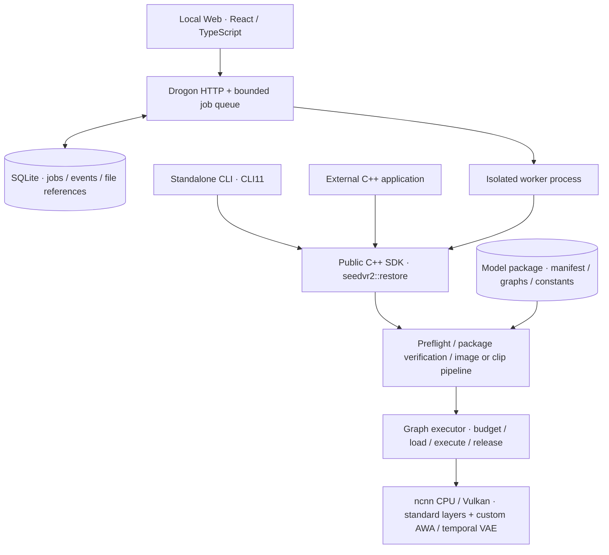
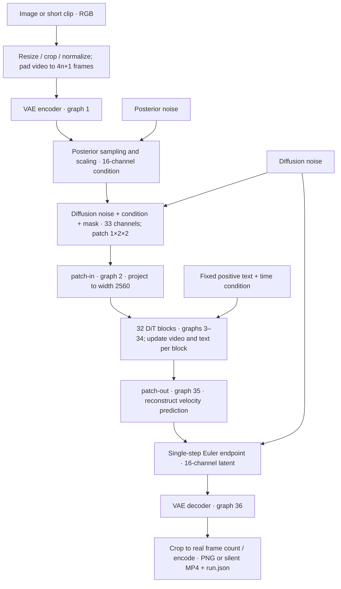
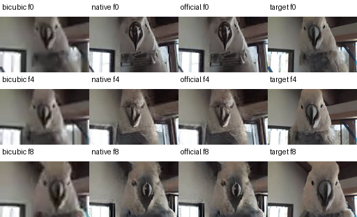
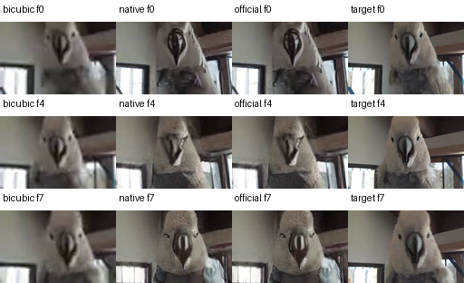
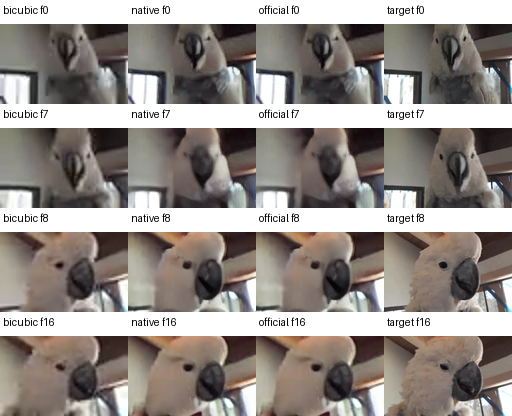

# SeedVR2 ncnn Vulkan

[中文](README.md) · [Architecture](#architecture-and-design) · [Measured results](#measured-results-and-visual-comparisons) · [Tutorial (Chinese)](docs/TUTORIAL.md) · [Source guide](docs/ARCHITECTURE.md) · [Contributing](CONTRIBUTING.md) · [License](LICENSE)

A native **C++20 / ncnn CPU/Vulkan** port of the official **SeedVR2 3B** image and short-video restoration model. The **standalone CLI, local Web application and installed C++ SDK** share one inference implementation. The tutorial covers pnnx export, custom adaptive window attention, temporal VAE and component-by-component validation.

**Validated model and configuration: SeedVR2 3B, FP32-B, one step, CFG=1.** The repaired implementation passes **73/73 tensor boundaries on all six retained trajectories**: three original clips, the held-out synthetic 17-frame clip on CPU and Vulkan, and a 256×256 natural image. The original motion 63/73 and padding 71/73 failures are closed with unchanged weights, official references, raw noise and full-model tolerance. [Repair details](docs/NUMERICS-REPAIR.md) · [Full records](artifacts/2026-09-10/video-numerics-v2/summary.json).

Image output long sides reach 512 pixels; video is limited to 17 frames and 128-pixel long sides, producing SDR MP4 without audio. This is an advanced porting case study for readers with C++, PyTorch and basic Vulkan experience, not an official ByteDance or Tencent release.

The application includes model identity/integrity checks, preflight, progress/cancellation, offline model copying and per-graph device/host weight placement. React / TypeScript / Ant Design is embedded in the native Drogon host; inference needs no Python, Node.js or cloud service. See [first use and offline transfer](docs/FIRST-RUN.md) and [memory-policy measurements](docs/MEMORY-VALIDATION.md).

## Architecture and design

The design addresses three concrete needs: **call the same model from a UI, a command line or another application; execute a full package on a device with limited VRAM; and trace every result to its inputs, model and implementation.** The application consists of a shared native core, a local job service and offline conversion tools. The following describes the implemented code.

### Application layers: three entry points, one native core



The Web service persists a request and its events, then starts a worker that calls the SDK. The browser reads progress and results through the job API; refreshing the page does not restart inference. CLI and external C++ callers use the same SDK directly, producing media and `run.json` independently of the Web service.

| Layer | Responsibility | Design reason / implementation |
| --- | --- | --- |
| Entry points | Files, parameters, progress and result presentation | Model mathematics stays out of the UI; [CLI](apps/cli/main.cpp), [Web](apps/studio/src) and the [SDK example](examples/sdk) share the computation entry point |
| Local job service | Queue, worker supervision, cancellation, persistent events and interrupted-run records | Process isolation lets the service handle inference failures; at most 8 unfinished jobs and 1 active job limit resource contention. See [service.cpp](src/jobs/service.cpp), [process.cpp](src/jobs/process.cpp) |
| Public SDK | `RestoreRequest`, `preflight`, `restore`, model verification/copying, callbacks and errors | Standard C++ types keep callers independent of Web and ncnn internals; CLI tests and integrations exercise the same implementation. See [pipeline.hpp](include/seedvr2/pipeline.hpp), [adapter](src/engine/ncnn/pipeline.cpp) |
| Model pipeline | VAE, posterior sampling, conditioning, 32 DiT blocks, Euler and output orchestration | Image and video retain their layout and temporal semantics while sharing the graph executor. See [image.cpp](src/engine/ncnn/image.cpp), [video.cpp](src/engine/ncnn/video.cpp) |
| Model package | Source and sampling identity, graph/constants inventory, sizes and hashes | Exported artifacts are separate from application installation; offline copies are verified at both ends. See [package.cpp](src/engine/ncnn/package.cpp), [reviewed identities](policies/reviewed-packages.json) |
| ncnn execution | Graph loading, backend selection, layer dispatch, resource release and custom operators | Standard operators use ncnn; custom layers implement SeedVR2-specific semantics. See [inference.hpp](src/engine/ncnn/inference.hpp), [graph.hpp](src/engine/ncnn/graph.hpp), [awa.cpp](src/engine/ncnn/awa.cpp), [video_layers.cpp](src/engine/ncnn/video_layers.cpp) |

These boundaries also define how to test: use CLI for runs without a UI, an external SDK consumer for integration, and the Web service for queue, cancellation and recovery behavior. The [source guide](docs/ARCHITECTURE.md) maps further changes to implementation files.

### Model pipeline: why 36 graphs

The 3B package contains **1 VAE encoder + 1 patch-in + 32 DiT blocks + 1 patch-out + 1 VAE decoder = 36 ncnn graphs**. Component boundaries support comparison against identical official inputs and allow weights to be loaded and released with each stage. C++ orchestrates sampling, layouts and media handling.



Here `H/W` are processed pixel dimensions, `Tₚ` is the padded frame count, `L=(Tₚ−1)/4+1`, and `N=L×(H/16)×(W/16)`. An image has `Tₚ=L=1`.

| Boundary | Logical shape / meaning in the current 3B package |
| --- | --- |
| VAE input and posterior | Input `3×Tₚ×H×W`; posterior `32×L×(H/8)×(W/8)`, split into 16 mean and 16 log-variance channels |
| DiT conditioning | 16 diffusion-noise channels + 16 sampled-posterior channels + 1 mask; `1×2×2` patches flatten to `N×132` |
| DiT backbone | Video `N×2560`, retaining the temporal/spatial grid inside blocks; text `58×2560`; 20 heads of width 128 |
| Output | patch-out produces `N×64`, reconstructed as 16-channel velocity; Euler produces the latent decoded by the VAE |

**Video uses the temporal VAE and 3D attention jointly across the clip's latent.** For example, 8 frames become 9 by repeating the last frame, yielding 3 latent time positions; decoded output is cropped back to 8 frames. Temporal convolutions and first-frame rules are retained, with cross-clip VAE cache disabled. Reports record the input clip, padding and output crop. Fixed positive text and time conditions are supplied by the package; the current API does not accept free-form text prompts.

### AWA: preserve export semantics, execute windows on Vulkan

Adaptive window attention changes its window sizes and boundaries with the temporal/spatial grid. Tracing window loops at one shape cannot represent other shapes. Export therefore uses pnnx **`moduleop` to preserve the AWA boundary**, followed by a checked mapping to **`SeedVR2AWA`** that verifies attributes, inputs/outputs, normalization weights and RoPE frequencies. Runtime code generates window indices from the actual input shape.

The path is **official implementation and weights → PyTorch export expression → TorchScript / pnnx → checked custom-layer mapping → `.param/.bin` package → native CPU/Vulkan**. Python, PyTorch and pnnx prepare and verify the package; C++ executes it. See [awa_export_module.py](tools/awa_export_module.py), [export_awa.py](tools/export_awa.py) and [real DiT block export](tools/export_dit_block.py).

Each AWA layer performs these steps:

1. Plan regular/shifted clipped windows on the actual grid. Shifted windows use a half-window offset and clipped boundaries, without cyclic wrapping.
2. Gather video Q/K/V and repeat the complete text Q/K/V in every window, applying Q/K normalization and multimodal 3D RoPE.
3. Compute joint video/text attention within the window. Vulkan reuses the pinned ncnn SDPA QK/PV shaders with an FP32 softmax adapter; video results are scattered to their positions and text results are averaged equally across windows.

The Vulkan implementation combines [gather](src/engine/ncnn/shaders/awa_gather.comp), [scatter](src/engine/ncnn/shaders/awa_scatter.comp) and [text mean](src/engine/ncnn/shaders/awa_text_mean.comp) shaders with the [FP32 SDPA adapter](src/engine/ncnn/softmax.cpp). The CPU path supports identical-input comparisons. Vulkan requests check every layer's capability and AWA dispatch counts, with no automatic CPU fallback. Codecs, layouts, noise and Euler run on the host; graph-boundary tensors are downloaded and uploaded for the next graph.

### Memory and packages: explicit lifetime and recorded decisions

Each graph follows **create/check graph structure → query budget → choose placement and load weights → execute and retrieve outputs → destroy Net and allocators → next graph**. The full roughly 20 GB of FP32 graph files need not reside in memory together. The cost is file reading, graph loading and host/GPU transfers during each run. Necessary outputs survive between graphs; shader pipeline cache is shared within the run.

`auto / device / host` controls weight placement per graph. Automatic mode reads the device budget, estimates weight preparation space from graph file size and reserves headroom before requesting device or host-visible memory. `host` still executes Vulkan. Policy and device queries live in [memory_policy.cpp](src/runtime/memory_policy.cpp) and [memory.hpp](src/engine/ncnn/memory.hpp). Reports record placement requests, reasons and budgets around loading/release; the driver determines actual residency. The estimate does not cover all activations, workspace and allocator overhead, so it cannot guarantee freedom from allocation failure on every device.

Buffered weight reading is the default; optional read-only `mmap` remains alive until its Net is destroyed. The model uses no autoregressive KV cache, and the application keeps no full-package weight cache across jobs. Preflight checks parameters, input, paths, output space, device and package identity before full weight verification. Offline copying verifies both ends and publishes the new directory after success. Package identity comes from project review; numerics and quality have separate reports.

### Validation design: trace the results to their execution

Official references and candidate export code are maintained separately. The current **FP32-B** reference adapts pinned official mathematics to CPU PyTorch, with an explicit distinction from the official default BF16/Apex/FlashAttention path. Comparisons bind raw posterior and diffusion noise as well as input data; equal seeds alone do not imply equal random sequences across frameworks.

The full contract checks **73 tensor boundaries: two outputs from each of 32 DiT blocks, plus nine input, VAE, conditioning and endpoint boundaries**. Reference identity, shapes, types, completeness and matching inputs are checked before error calculation; missing or duplicate boundaries fail. Run reports also identify the manifest, converter/runtime commits, executable and actually loaded SDK hashes. See [pipeline_contract.py](tools/pipeline_contract.py), [pipeline_replay.py](tools/pipeline_replay.py), [provenance.hpp](src/engine/ncnn/provenance.hpp).

Build/interface tests, small operators, real components, complete execution, tensor errors, task quality and performance are reported separately. Identical-input component tests localize errors; complete trajectories expose error propagation; fixed-target and bicubic comparisons measure restoration behavior for each case. The following figures and tables retain their passes, failures and measurement conditions.

## Measured results and visual comparisons

Recorded **2026-09-10**, using the frozen **0.7.0 numerical-repair CLI/SDK**, SeedVR2 **3B / single-step FP32-B**, **Linux x86_64 / RTX 4060 Laptop 8 GiB**, 32 GiB host RAM. Each clip starts as **64×40, 8 fps** and produces **128×80** output. The cases use one natural source with fixed synthetic degradation; the cut is an artificial splice. They are development examples, not a representative benchmark.

**All three original clips complete inference and pass all 73 numerical boundaries.** Fixed-target quality remains below bicubic for both native and official FP32-B outputs; the repaired outputs and quality measurements are shown together below.

The four columns are **bicubic input baseline → native ncnn/Vulkan → official FP32-B → fixed target**. These are the original retained comparison images, rendered from pre-codec RGB8 with no extra enhancement. `f0` is the first frame. The target comes from an already compressed source, not camera-original ground truth.

### Natural motion · 9 frames

Frames 0, 4 and 8; no temporal padding.



[Input clip](tests/fixtures/video-bounded/motion-9/input.mp4) · [Native output MP4](artifacts/2026-09-10/video-numerics-v2/motion-9-output.mp4) · [Official preview MP4](artifacts/2026-09-10/video-numerics-v2/quality/motion-9/official.mp4) · [Per-frame data](artifacts/2026-09-10/video-numerics-v2/quality/motion-9/report.json)

### Tail padding · 8 frames → 9 → 8

Frames 0, 4 and 7. The last frame is repeated for model input, then the output is cropped back to 8 frames.



[Input clip](tests/fixtures/video-bounded/padding-8/input.mp4) · [Native output MP4](artifacts/2026-09-10/video-numerics-v2/padding-8-output.mp4) · [Official preview MP4](artifacts/2026-09-10/video-numerics-v2/quality/padding-8/official.mp4) · [Per-frame data](artifacts/2026-09-10/video-numerics-v2/quality/padding-8/report.json)

### Artificial cut · 17 frames

Frames 0, 7, 8 and 16. The splice is immediately before frame 8, so both sides of the cut remain visible.



[Input clip](tests/fixtures/video-bounded/cut-17/input.mp4) · [Native output MP4](artifacts/2026-09-10/video-numerics-v2/cut-17-output.mp4) · [Official preview MP4](artifacts/2026-09-10/video-numerics-v2/quality/cut-17/official.mp4) · [Per-frame data](artifacts/2026-09-10/video-numerics-v2/quality/cut-17/report.json)

### Numerical and output checks

| Case | Original → repaired | RGB8 max difference¹ | Native graphs | Repair report |
| --- | --- | --- | --- | --- |
| motion-9 | 63/73 → **73/73** | 1 | 36/36 Vulkan | [JSON](artifacts/2026-09-10/video-numerics-v2/motion-9.replay.json) |
| padding-8 | 71/73 → **73/73** | 1 | 36/36 Vulkan | [JSON](artifacts/2026-09-10/video-numerics-v2/padding-8.replay.json) |
| cut-17 | 73/73 → **73/73** | 1 | 36/36 Vulkan | [JSON](artifacts/2026-09-10/video-numerics-v2/cut-17.replay.json) |

¹ Native versus official, before encoding, on a 0–255 channel scale. Frame count, dimensions, timestamps and no-audio checks pass. All graph layers run on Vulkan without CPU fallback or recorded Vulkan validation errors. Every boundary, including intermediates, uses the unchanged diagnostic tolerance `abs(error) <= 0.001 + 0.001 * abs(reference)`.

The held-out **17-frame 128×128 synthetic clip** passes 73/73 on CPU and Vulkan. The **256×256 natural JPEG** also passes 73/73 with RGB8 max difference 1. [Six trajectories and implementation identities](artifacts/2026-09-10/video-numerics-v2/summary.json).

### Restoration quality

Each cell is **PSNR (dB) / RGB SSIM**, averaged over the real output frames, with no border crop. Higher means closer to this fixed target. Padded frames are excluded.

| Case | Bicubic baseline | Native ncnn/Vulkan | Official FP32-B |
| --- | --- | --- | --- |
| motion-9 | 26.93 / 0.8560 | 20.01 / 0.6187 | 20.01 / 0.6187 |
| padding-8 | 26.82 / 0.8539 | 19.70 / 0.5973 | 19.70 / 0.5973 |
| cut-17 | 26.80 / 0.8405 | 23.24 / 0.7686 | 23.24 / 0.7686 |


**Both native and official FP32-B outputs score below bicubic on these three examples.** The panels show changes in beak and feather detail relative to the target. Native and official values are calculated separately and look equal at this display precision. This is a retained negative result under the stated low-resolution setup; it is not an evaluation of the official default BF16/FlashAttention path. No post-hoc quality pass threshold is used.

### Runtime and memory

| Case | Native wall time (s) | Sampled process RSS (GiB) | Whole-card GPU use (MiB) |
| --- | --- | --- | --- |
| motion-9 | 28.11 | 0.918 | 2884 |
| padding-8 | 32.20 | 0.888 | 2871 |
| cut-17 | 32.25 | 0.927 | 3357 |


One sequential run per case, including package hashing, weight loading, computation and diagnostic tensor output; this does not establish normal inference speed or a speedup. Whole-card GPU memory includes desktop use and is not process-exclusive VRAM. RSS is not an allocation-class breakdown of weights, activations and workspace. Full sampling data is retained in [the summary](artifacts/2026-09-10/video-numerics-v2/summary.json).

### Numerical repairs and operator checks

The fixes address FP32 operation order and error propagation through the full model: preprocessing, blocked VAE convolution and shortcut bias, RMSNorm/FrameNorm, Q/K prescaling, RoPE, window text pooling, SiLU/softmax, and compensated DiT dot products.

| Check | Result / scope |
| --- | --- |
| CPU/Vulkan DiT RMSNorm | 94,720 fixture values per backend match byte for byte; the CPU's 31 violations are fixed |
| VAE projection / shortcuts | 431,328 oneDNN FP32 fixture outputs match byte for byte with device and host weight placement |
| Real encoder isolation | 15,360 posterior projection values match on identical inputs; full-encoder error propagation is retained |
| Native build, operators and interfaces | **36/36 locally**; installed SDK consumer and CLI load the same library |
| Software Vulkan CI | **10 passed, 12 capability skips**; llvmpipe lacks required FMA residual behavior and preflight rejects complete FP32-B inference |

`engine devices` includes an independent FP32 arithmetic probe. Passing it is a prerequisite, not a model certificate. Skips are not numerical passes; the initial Mesa failures remain archived. Full CPU/NVIDIA model runs are recorded separately from small CI tests.

[Repair and reproduction](docs/NUMERICS-REPAIR.md) · [New evidence and failed candidates](artifacts/2026-09-10/video-numerics-v2/README.md) · [Original failures](artifacts/2026-09-10/bounded-video-v1/README.md) · [Fixture provenance](tests/fixtures/video-bounded/SOURCE.md) · [Remaining work](docs/CURRENT-GAPS.md)

## Start without downloading model weights

On Ubuntu 24.04, install:

```sh
sudo apt-get update
sudo apt-get install -y build-essential cmake ninja-build python3 python3-venv \
  pkg-config ripgrep libssl-dev libjpeg-dev libsqlite3-dev libvulkan-dev \
  glslang-dev glslang-tools spirv-tools mesa-vulkan-drivers vulkan-validationlayers \
  libavformat-dev libavcodec-dev libavutil-dev libswscale-dev libomp-dev \
  uuid-dev zlib1g-dev

git clone https://github.com/mingshi2333/seedvr2-ncnn-vulkan.git
cd seedvr2-ncnn-vulkan
python3 tools/build_native.py --cli-only --check
python3 tools/build_native.py --cli-only --jobs 2
dist/tutorial/bin/seedvr2 engine self-test --backend cpu
dist/tutorial/bin/seedvr2 engine devices
dist/tutorial/bin/seedvr2 engine self-test --backend vulkan --gpu 0
```

The helper prepares hash-locked dependencies, builds, runs small native tests and
installs the CLI/worker/SDK to `dist/tutorial`. It stops at the first failure and does
not download checkpoints. `--plan` prints its commands; `--offline` requires cached
dependency archives. A missing Vulkan device is not a successful GPU test.

The default build also includes the local Web application and requires Node.js 24+
and npm; omit `--cli-only` when those prerequisites are installed. Runtime inference
does not require Python, Node.js, a cloud service or a CDN.

## Learning sequence

1. Build and compare the embedded regular/shifted AWA fixtures.
2. Generate independent official FP32-B references, export a preserved pnnx `moduleop`,
   lower only checked attributes, and compare ncnn CPU/Vulkan outputs.
3. Download the pinned official model and compare one real DiT block on identical inputs.
4. Assemble the image VAE, patch projections and all 32 DiT blocks into a 36-graph package.
5. Add the temporal VAE and whole-clip 3D attention, preserving causal and first-frame semantics.
6. Inspect numerical boundaries, SDK integration, installation, memory measurements and failures.

Commands, expected outcomes and source pointers are in [the tutorial](docs/TUTORIAL.md).
[Architecture](docs/ARCHITECTURE.md) maps the SDK, CLI, worker, model mathematics,
package validation and resource lifetime to their implementation files.

## Models and inference

```sh
python3 tools/prepare_models.py --list
python3 tools/prepare_models.py
```

This fetches four files (about 14.57 GB) from the pinned official
[ByteDance-Seed/SeedVR2-3B repository](https://huggingface.co/ByteDance-Seed/SeedVR2-3B/tree/37255ff8cccfb01071b87f635a5948ca8d53117c)
into `.cache/models`. Downloads support resume and SHA-256 verification. Cached valid
files are reused; `--offline` verifies final cached files without network access.
These are PyTorch checkpoints, **not ready-to-run ncnn packages**.

Export uses a separate Python 3.13 / PyTorch 2.9.0+cpu environment and a separately
pinned pnnx build. Follow the [export lessons](docs/TUTORIAL.md#2-看清自定义-awa-如何导出).
Image graphs total about 20.44 GB; video graphs total about 21.10 GB, with unchanged
DiT files reused through hard links during export. Checkpoints, intermediate files,
diagnostic tensors and independent installation copies require additional disk space.
There is no promise of a cross-device peak RAM or disk budget for conversion.

Once those lessons have produced the packages:

```sh
dist/tutorial/bin/seedvr2 run --model .cache/tutorial/image-package \
  --input tests/fixtures/natural/astronaut-degraded.jpg \
  --output .cache/tutorial/image-result --size 256 --backend vulkan --gpu 0

dist/tutorial/bin/seedvr2 run-video --model .cache/tutorial/video-package \
  --input docs/examples/video-demo-input.mp4 --output .cache/tutorial/video-result \
  --frames 6 --size 64 --backend vulkan --gpu 0
```

Output directories must be new or empty. Results include PNG/MP4 and `run.json`.
Add `--check` for preflight; actual execution verifies all model payload files.
Unknown package identities are rejected. Review export differences rather than
bypassing `policies/reviewed-packages.json`.

For the Web build, start `dist/tutorial/bin/seedvr2-web --model PATH --video-model PATH`
and open the printed loopback URL. The installed `seedvr2-studio` launcher expects
packages under `models/image` and `models/video`, or the corresponding environment
variables. It does not automatically download or export missing weights.

## Supported scope and evidence

| Area | Current scope |
| --- | --- |
| Images | PNG/JPEG, output long side 64–512, multiples of 16; RGB8 PNG |
| Video | First 1–17 frames jointly, output long side 64–128; 8-bit SDR, square pixels, no output audio |
| Runtime | Linux x86_64; CPU and RTX 4060 Laptop used for retained full-model tests |
| Memory | Per-graph automatic device/host weight placement; no activation offload or automatic OOM retry |
| Interface | Shared C++ SDK, standalone CLI, embedded React/TypeScript/Ant Design local Web |
| Not implemented | 7B, streaming cache, long-video chunking, HDR, large-resolution tiling, full model quality certification |

Retained 0.7.0 evidence includes 14 native tests, 40 AWA comparisons, 27 real-component
comparisons, two 73-boundary video comparisons, and a 73-boundary natural-image comparison.
These counts describe the [recorded candidate](artifacts/2026-09-08/memory-v1/README.md),
not every future checkout. Historical failures and invalidated SDK evidence remain visible.
The natural-image quality example has a retained negative result; numerical parity is
not perceptual-quality acceptance.

[GitHub Actions](https://github.com/mingshi2333/seedvr2-ncnn-vulkan/actions/workflows/native.yml)
builds/tests native Linux and software Vulkan without full model weights. Full 3B GPU
validation is a separate real-device protocol. The Ubuntu GCC CLI, Clang CLI and GCC
Web jobs all passed for numerical repair commit `7e56479`: each native suite reports
**24 passed and 12 capability skips**, with **54/54** additional Web interface checks.
The [current CI archive](artifacts/2026-09-10/github-ci-numerics-v2/README.md) retains
the exact commit, raw dependency/build logs, reports and skip reasons. These software
Vulkan checks do not replace the separate full-model CPU/NVIDIA measurements.
Historical raw model/tensor paths in
reports belong to the developer's machine; the large files are not in Git.

## License

Original code and documentation: [Apache-2.0](LICENSE). Upstream code and fixtures
retain their original terms and attribution in [NOTICE](NOTICE).
The tested FFmpeg/libx264 configuration uses GPL components; distributing a combined
binary requires complying with the actual dependency licenses. See
[source and dependency licensing](docs/LICENSING.md).
This repository publishes source and small diagnostic fixtures, not model downloads or
a prebuilt portable application.
