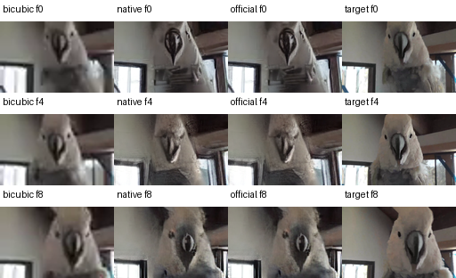
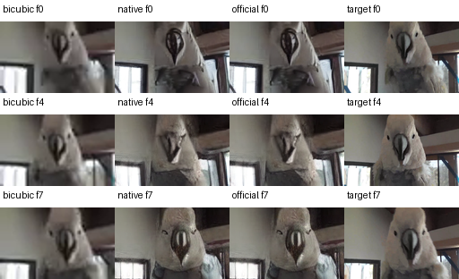
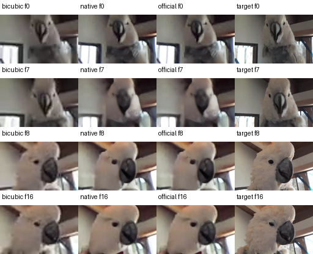

# SeedVR2 ncnn Vulkan

[English](README.en.md) · [实测对照](#实测结果与对照图) · [从零开始的教程](docs/TUTORIAL.md) · [架构与源码导航](docs/ARCHITECTURE.md) · [贡献方法](CONTRIBUTING.md) · [许可证](LICENSE)

将官方 **SeedVR2 3B** 移植为使用 **ncnn CPU/Vulkan** 的原生 C++20 图片与短视频修复应用。提供 **独立 CLI、本地 Web 和可安装的 C++ SDK**，共用同一推理实现；教程覆盖 pnnx 导出、自定义 adaptive window attention、时序 VAE 和逐组件验证。

**状态：0.7.0 原生预览，完整模型认证尚未通过。** 图片输出长边最高 512，视频最多 17 帧、长边最高 128，输出为无音轨 SDR MP4。真实推理已接通，数值和画质限制见下面的实测。项目面向已有 C++、PyTorch 和基本 Vulkan 经验的读者，不属于 ByteDance 或 Tencent 官方发行。

支持模型身份/完整性校验、参数预检、进度与取消、离线模型复制、逐图 GPU/RAM 权重选择。React / TypeScript / Ant Design 界面内嵌于 Drogon C++ 服务；运行时无需 Python、Node 或云服务。首次使用见[安装与离线搬移](docs/FIRST-RUN.md)，内存策略及代价见[内存验证](docs/MEMORY-VALIDATION.md)。

## 实测结果与对照图

记录日期 **2026-09-10**。使用冻结的 **0.7.0 原生 CLI/SDK**、SeedVR2 **3B / 单步 FP32-B**，设备为 **Linux x86_64 / RTX 4060 Laptop 8 GiB**，主机内存 32 GiB。输入为 **64×40、8 fps**，输出均为 **128×80**。三个案例来自同一自然素材，退化方式固定，镜头切换为人工拼接；这是开发样例，尚不构成代表性视频质量基准。

**三个短片都能完整执行；其中两个完整数值对照仍失败，三个案例的固定目标画质指标均低于 bicubic。** 以下直接展示这些结果。

每张图从左到右依次为 **bicubic 输入基线 → 原生 ncnn/Vulkan → 官方 FP32-B → 固定目标**。直接引用已归档的编码前 RGB8 对照图，没有再次增强；`f0` 表示第 0 帧。固定目标来自已压缩的源视频，不是相机原始真值。

### 自然运动 · 9 帧

展示第 0、4、8 帧，无需时序补齐。



[输入短片](tests/fixtures/video-bounded/motion-9/input.mp4) · [原生实际输出 MP4](artifacts/2026-09-10/bounded-video-v1/motion-9-output.mp4) · [官方预览 MP4](artifacts/2026-09-10/bounded-video-v1/quality/motion-9/official.mp4) · [逐帧数据](artifacts/2026-09-10/bounded-video-v1/quality/motion-9/report.json)

### 尾帧补齐 · 8 帧 → 9 帧 → 8 帧

展示第 0、4、7 帧。模型输入重复尾帧补至 9 帧，实际输出再裁回 8 帧。



[输入短片](tests/fixtures/video-bounded/padding-8/input.mp4) · [原生实际输出 MP4](artifacts/2026-09-10/bounded-video-v1/padding-8-output.mp4) · [官方预览 MP4](artifacts/2026-09-10/bounded-video-v1/quality/padding-8/official.mp4) · [逐帧数据](artifacts/2026-09-10/bounded-video-v1/quality/padding-8/report.json)

### 人工镜头切换 · 17 帧

展示第 0、7、8、16 帧。切换发生在第 8 帧之前，图中保留切换前后两帧。



[输入短片](tests/fixtures/video-bounded/cut-17/input.mp4) · [原生实际输出 MP4](artifacts/2026-09-10/bounded-video-v1/cut-17-output.mp4) · [官方预览 MP4](artifacts/2026-09-10/bounded-video-v1/quality/cut-17/official.mp4) · [逐帧数据](artifacts/2026-09-10/bounded-video-v1/quality/cut-17/report.json)

### 数值与输出检查

| 案例 | 完整张量边界 | RGB8 最大差¹ | 原生图执行 | 原始参考报告 |
| --- | --- | --- | --- | --- |
| motion-9 | **63/73 · 未通过** | 1 | 36/36 Vulkan | [JSON](artifacts/2026-09-10/bounded-video-v1/motion-9-reference.json) |
| padding-8 | **71/73 · 未通过** | 1 | 36/36 Vulkan | [JSON](artifacts/2026-09-10/bounded-video-v1/padding-8-reference.json) |
| cut-17 | **73/73 · 此例通过** | 1 | 36/36 Vulkan | [JSON](artifacts/2026-09-10/bounded-video-v1/cut-17-reference.json) |


¹ 原生与官方在编码前的 0–255 通道值差异。三个最终 `decoded` FP32 边界均通过，但不能豁免此前中间张量的失败。输出帧数、尺寸、时间戳和无音轨检查均通过；图层均由 Vulkan 执行，无 CPU 回退，保留日志无 Vulkan 校验错误。73 个边界沿用 `atol=rtol=0.001` 的诊断容差。

### 修复质量数据

每格为 **PSNR（dB）/ RGB SSIM**，对实际输出帧取均值，不裁边；数值越高表示越接近本例固定目标，补齐帧不参与统计。

| 案例 | bicubic 基线 | 原生 ncnn/Vulkan | 官方 FP32-B |
| --- | --- | --- | --- |
| motion-9 | 26.93 / 0.8560 | 20.01 / 0.6187 | 20.01 / 0.6187 |
| padding-8 | 26.82 / 0.8539 | 19.70 / 0.5973 | 19.70 / 0.5973 |
| cut-17 | 26.80 / 0.8405 | 23.24 / 0.7686 | 23.24 / 0.7686 |


**这三个样例中，原生与官方 FP32-B 的指标都低于 bicubic。** 对照图可见喙部与羽毛细节偏离目标。原生和官方数值分别计算，在表格显示精度下接近；这是当前低分辨率设置中的负结果，不代表已评估官方默认 BF16/FlashAttention 路径。没有根据这些结果事后设置画质通过门槛。

### 耗时与内存

| 案例 | 原生总耗时（秒） | 进程 RSS 采样峰值（GiB） | 整卡显存采样峰值（MiB） |
| --- | --- | --- | --- |
| motion-9 | 28.09 | 1.184 | 3633 |
| padding-8 | 27.62 | 1.126 | 4202 |
| cut-17 | 31.31 | 0.893 | 5521 |


每例只做一次串行实测，总耗时包含模型包哈希、权重载入和计算，不据此宣称加速。整卡显存包含桌面等其他进程，不能视为模型独占显存；RSS 也不是权重、激活和工作区的独立分项峰值。完整采样见[原始汇总](artifacts/2026-09-10/bounded-video-v1/summary.json)。

### 算子验证与失败定位

| 检查 | 结果 | 验证范围 |
| --- | --- | --- |
| AWA CPU / Vulkan | 8/8 | 4 个 pnnx 导出案例、16 组输出；最大绝对差 1.61e-6 |
| motion-9 · blocks 19–31 | 26/26 | 每块使用相同官方输入 |
| padding-8 · blocks 15–17 | 6/6 | 每块使用相同官方输入 |
| motion-9 · all 32 DiT blocks | 64/64 | 仅替换官方起点，后续仍消费原生输出 |
| motion-9 · block 19 replay | **失败复现** | 两个输出与原失败轨迹逐字节一致 |


AWA 使用 `(3,5,8)`、`(5,5,8)` 两种网格，各含 regular/shifted、20 heads、58 个文本位置，QKV 为合成输入；DiT 隔离检查使用真实 checkpoint 权重。实验支持进入 DiT 前的差异在后续计算中被放大，尚未唯一定位到一个上游算子，也未修复原始 63/73 和 71/73 轨迹。

[协议与复现命令](docs/BOUNDED-VIDEO-RESULTS.md) · [报告及失败日志](artifacts/2026-09-10/bounded-video-v1/README.md) · [素材来源](tests/fixtures/video-bounded/SOURCE.md) · [机器可读结果](artifacts/2026-09-10/bounded-video-v1/summary.json)

## 第一次克隆：先做不需要大模型的实验

先按 [教程第 1 课](docs/TUTORIAL.md#1-从干净克隆开始) 安装 Linux 开发依赖。随后：

```sh
git clone https://github.com/mingshi2333/seedvr2-ncnn-vulkan.git
cd seedvr2-ncnn-vulkan
python3 tools/build_native.py --cli-only --check
python3 tools/build_native.py --cli-only --jobs 2
dist/tutorial/bin/seedvr2 engine self-test --backend cpu
dist/tutorial/bin/seedvr2 engine self-test --backend vulkan --gpu 0
```

构建脚本串起锁定依赖准备、编译、小型测试和安装，不下载模型权重。新克隆没有 `dist/` 或转换模型；下面的已有安装说明不能替代构建和导出。无 Vulkan 设备时先完成 CPU 实验，并保留设备缺失原因。

继续按 [完整教程](docs/TUTORIAL.md) 做 AWA 导出、单个真实 DiT 块、完整图片和时序视频。官方权重下载已经自动化：

```sh
python3 tools/prepare_models.py --list
python3 tools/prepare_models.py
```

固定官方 revision、约 14.57 GB，支持续传和 SHA-256 校验；`--offline` 仅验证缓存。下载后还需 pnnx 转换，详见教程。源仓库包含小型测试夹具和历史报告，未上传官方大权重、转换包或便携二进制。原生 CI 的实际结果见 [GitHub Actions](https://github.com/mingshi2333/seedvr2-ncnn-vulkan/actions/workflows/native.yml)，大模型实机记录单独保留。

Ubuntu GCC CLI、Clang CLI、GCC Web 三项远端 CI 已通过；对应提交、原始报告与日志收集修复见[远端验证归档](artifacts/2026-09-10/github-ci-v1/README.md)。

## 已有本机安装时使用

已有本地构建和完整模型包时，从项目目录启动：

```sh
dist/seedvr2-0.7.0/bin/seedvr2-studio
```

打开打印的地址，默认 `http://127.0.0.1:8877/`。导入 PNG/JPEG 或 MP4/MOV/WebM/MKV，选择输出长边、设备和片段帧数，开始处理。刷新或关闭浏览器后，服务进程会继续处理。任务页保留历史；服务退出会中断未完成任务，重开设置会创建一次新运行。

本机安装已有转换好的 `models/image` 和 `models/video`，启动脚本会按安装位置自动找到它们。模型文件独立保存，不内嵌在脚本中；缺失时不会自动下载或转换。Git 克隆与 `cmake --install` 不附带大模型。已提供的下载、导出、测试脚本及其边界见 [首次使用的自动化说明](docs/FIRST-RUN.md#已转换模型与自动化范围)。

- 每张输入最多 32 MiB、32 M 像素；输出长边 64–512、16 的倍数，裁剪后短边至少 64。Web 提供 128/256/384/512 四档。
- 视频最多 256 MiB、8 位 SDR、方形像素且方向已转正；短片长边 64–128、最多 17 帧，输出无音轨 MP4。当前不支持 HDR、长视频分块或流式缓存，详见[短视频范围](docs/video-runtime.md)。
- 当前预处理保持比例后居中裁至 16 的倍数。PNG 按 RGB8 输出，暂不保留透明度、ICC、EXIF 方向及其他元数据。
- 队列上限为 8 个未完成任务，每次执行 1 个；失败与取消不会暴露半成品下载。
- 端口冲突时使用 `--port 0`。`--database PATH` 可选择工作区；启动脚本使用 `SEEDVR2_MODEL_DIR` 与 `SEEDVR2_VIDEO_MODEL_DIR` 覆盖默认的安装模型目录。
- 图片包图文件约 20.44 GB，视频包约 21.10 GB，准备工具以硬链接复用未变的 DiT 权重。文件完整性会在每次处理前核验，总耗时包含哈希、权重装载和计算。

无需权重的 AWA CPU/Vulkan 自测位于“测试记录”。“模型验收”保留 12 项严格要求及缺项；一次处理或自测成功不会签发模型证书。“报告与分享”可附加实际处理记录，下载 Discussion 草稿及原始报告。

## 独立 CLI

```sh
dist/seedvr2-0.7.0/bin/seedvr2 run-video --model dist/seedvr2-0.7.0/models/video \
  --input /path/to/input.mp4 --output /path/to/new-video-result \
  --frames 17 --size 128 --backend vulkan --gpu 0 --seed 666
```

视频完整时序链路、包准备和复现命令见 [video-runtime.md](docs/video-runtime.md)。

```sh
dist/seedvr2-0.7.0/bin/seedvr2 run --model dist/seedvr2-0.7.0/models/image \
  --input /path/to/input.png --output /path/to/new-result \
  --size 512 --backend vulkan --gpu 0 --seed 666

# 无需启动 Web，CPU 使用同一条完整处理链
dist/seedvr2-0.7.0/bin/seedvr2 run --model dist/seedvr2-0.7.0/models/image \
  --input /path/to/input.jpg --output /path/to/another-result \
  --size 256 --backend cpu --threads 4
```

图片输出目录须不存在或为空，包含 `output.png`、与结果对齐的 `comparison-input.png` 和 `run.json`。标准输出为结果 JSON，标准错误输出进度与诊断。`--diagnostic-tensors` 额外保存中间张量供开发数值验证。CLI 运行结果保存在指定目录，不会自动加入 Web 队列。

```sh
dist/seedvr2-0.7.0/bin/seedvr2 engine status
dist/seedvr2-0.7.0/bin/seedvr2 engine devices
dist/seedvr2-0.7.0/bin/seedvr2 engine self-test --backend cpu --save
dist/seedvr2-0.7.0/bin/seedvr2 engine self-test --backend vulkan --gpu 0 --save
dist/seedvr2-0.7.0/bin/seedvr2 plan --request examples/plan-720p.json --save
dist/seedvr2-0.7.0/bin/seedvr2 models status
dist/seedvr2-0.7.0/bin/seedvr2 models audit --bundle examples/model-evidence-empty
dist/seedvr2-0.7.0/bin/seedvr2 history list --kind operator-test
```

空证据包审计退出 **6** 是预期结果，表示没有模型证书。`models status` 查询退出 0 只表示查询成功。规划记录为 `PLANNED`，与真实图像任务分开保存。CLI 的全局 `--database PATH` 置于子命令前，可与 Web 共用工作区。

## 构建

开发依赖：C++20、CMake 3.25+、Ninja、Python 3.12+、Node 24+；OpenSSL、SQLite、libjpeg、zlib、uuid、Vulkan headers/loader、glslang 与 SPIRV-Tools；pkg-config 与 FFmpeg 开发库 libavformat/libavcodec/libavutil/libswscale，视频输出需要 libx264 编码器。运行时需要对应共享库 ABI，具体版本/许可在 `third_party/media`。导出还需要项目私有 PyTorch 环境，见[完整模型包准备](docs/image-runtime.md)。

```sh
python3 tools/prepare_native.py
python3 tools/prepare_engine.py --jobs 4
npm ci --prefix apps/studio --ignore-scripts
npm run build --prefix apps/studio
cmake --preset release
cmake --build --preset release --parallel 4
ctest --preset release
cmake --install build/release --prefix dist/seedvr2-0.7.0
```

依赖准备显式联网，版本和归档 SHA-256 已锁定；缓存齐全后使用 `--offline`。CMake 不下载依赖。运行库锁定为 2026-09-08 查询时的官方 HEAD `3b7bdba7fc8aea8fd46779533eee027df77c639d`，转换器独立固定 `6a1bf000f363714839a36793addc8c879d3d899e`，没有使用相邻本地工作树。0.7.0 应用编译了经过哈希校验的 `host-buffer-v1` 分配器修正副本，原始 ncnn 源目录与归档不变；运行报告明确记录该修正和实际加载 SDK 的身份。旧导出及实验仍绑定原版本，不重新标注为新运行库；构建不会自动追随远端 HEAD。

只构建 CLI 和 worker：

```sh
python3 tools/prepare_native.py --cli-only
python3 tools/prepare_engine.py --jobs 4
cmake --preset cli
cmake --build --preset cli --parallel 4
```

该构建不寻找 Drogon、不构建 React，不要求 Node 或启动浏览器。

## 模型实测与架构

本轮 SDK、JPEG 修正、离线验证、组件复核、ABBA 内存/时间测量与 CI 的当前结论见 [DELIVERY-RESULTS.md](docs/DELIVERY-RESULTS.md)。以下旧图像/视频报告保留各自执行版本，不能代替当前构建的实测。公共 SDK 源码导航见 [ARCHITECTURE.md](docs/ARCHITECTURE.md)。

完整处理包含 VAE 编码、随机后验采样与缩放、patch 投影、32 层 DiT、自定义 AWA、单步 Euler endpoint 和 VAE 解码。图层按指定后端执行；请求 Vulkan 时不自动回退 CPU。预处理、张量布局、噪声和 Euler 标量运算在主机侧完成，并在报告中注明。

已完成两种尺寸的官方 FP32-B 全链路对比：每条轨迹 73 个中间结果逐元素通过，8 位输出最大相差 1。CPU 与最终优化后的 Vulkan 构建也对保留参考进行了复核。**这些是有明确范围的开发数值证据，不是图像质量验收或完整模型认证。** 视频早期的时序 VAE 16/16 个 CPU/Vulkan 子模型检查、6 帧 64×64 完整轨迹 73/73 通过记录继续保留。17 帧 128×128 的历史结果曾为 Vulkan 60/73、CPU 70/73，严格判失败；后续数值修复后同一保留轨迹在 CPU/Vulkan 均达到 73/73，见 [视频数值修复](docs/VIDEO-NUMERICS.md)。历史失败未删除，当前 0.7.0 两种内存策略的复核见 [内存验证](docs/MEMORY-VALIDATION.md)。官方 BF16/FlashAttention、长视频和正式验收阈值尚未完成。

- [短视频运行时](docs/video-runtime.md) / [包含负结果的视频验证](docs/video-validation.md)
- [最新 ncnn 的 FP16/BF16 实测与真实组件误差](docs/PRECISION-VALIDATION.md)
- [完整单图链路、模型包与复现命令](docs/image-runtime.md)
- [当前验证报告与限制](docs/image-validation.md) / [机器可读状态](docs/status.json)
- [应用框架和模块职责](docs/full-stack-framework.md) / [任务架构决定](docs/adr/0007-image-runtime-and-jobs.md)
- [严格模型验收](docs/model-validation.md) / [模型内部结构](docs/architecture.md)
- [本地 Web API](docs/local-web.md) / [OpenAPI](schemas/local-api.v1.openapi.json)
- [原生算子与导出设计](docs/native-backend.md) / [来源与许可](docs/provenance.md)

`video-*` 记录本轮视频扩展，`image-*` 保留 0.4.0 完整单图证据；`native-*`、`framework-*`、`foundation-*`、`web-*` 保留各自历史版本，不能用旧报告证明新构建。程序不会自动公开发布 Discussion。

## 开源与复用

原创源码和文档使用 [Apache-2.0](LICENSE)，原始第三方代码保留各自许可证和 [NOTICE](NOTICE)。完整 GPL-enabled FFmpeg/libx264 二进制的分发另有依赖许可要求；本仓库发布源码和小型证据，不宣称已完成便携二进制发行资格。详见 [许可范围](docs/LICENSING.md)。

欢迎复用组件拆分、独立参考、同输入误差定位和资源测量方法。新模型应重新核实维度、算子、设备与阈值；不要直接套用本项目的 3B 参数或把自测 PASS 当作完整模型认证。
