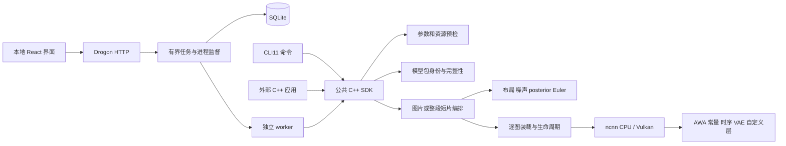

# 原生架构与源码导航

0.6.0，2026-09-08。目标是一个易测试的单机应用：本地 Web、独立 CLI、可安装 SDK 共用计算实现，避免引入额外服务或未有需求的扩展框架。

## 按修改目的查找源码

| 需求 | 入口 | 边界 |
| --- | --- | --- |
| 接入外部应用 | `include/seedvr2/pipeline.hpp`、`examples/sdk` | 只公开标准 C++ 类型、结果与回调；不暴露 ncnn/JSON |
| 首次运行、预检、复制模型 | `src/engine/ncnn/pipeline.cpp` | 设备/路径/几何/空间预检，API 到具体管线的适配 |
| CLI 参数和输出 | `apps/cli/main.cpp` | CLI11 解析，调用 SDK；JSON 输出与进度流分开 |
| Web 任务执行 | `apps/worker/main.cpp`、`src/jobs` | 独立进程、队列最多 8/同时执行 1、取消、恢复、事件 |
| HTTP/界面 | `apps/server`、`apps/studio/src` | 资源 ID 和本机会话；运行时静态资源内嵌 |
| 工作区 | `src/storage/workspace.cpp` | SQLite schema 3、媒体和结果引用、持久事件 |
| 单图/短片编排 | `src/engine/ncnn/image.cpp`、`video.cpp` | 顺序执行真实 36 图，不将整段视频拆为独立单帧恢复 |
| 共有推理数学 | `src/engine/ncnn/inference.hpp` | 后验采样、布局、噪声、条件与 Euler；不含 Web 状态 |
| 包认证 | `src/engine/ncnn/package.cpp`、`package.hpp`、`policies/reviewed-packages.json` | 审阅过的有效载荷身份、相对路径、文件大小与 SHA-256 |
| 图执行与权重生命周期 | `graph.hpp`、`weight_io.hpp` | 一次一图、CPU/Vulkan 明确选择、可选只读 mmap |
| 自定义数学 | `awa.cpp`、`constant.cpp`、`video_layers.cpp`、`shaders` | AWA 窗口与 RoPE、文本平均、常量、时序 VAE 变换 |
| 输入输出 | `image_io.cpp`、`video_io.cpp` | 有界解码、预处理、PNG/MP4、输入类型/色彩范围拒绝 |
| 当前实现身份和资源 | `provenance.hpp` | 可执行文件与实际加载 SDK 的 SHA；RSS 不冒充激活或工作区 |
| 官方参考与导出 | `tools/*_reference.py`、`tools/export_*.py` | 官方原文方法体的 FP32-B 适配和候选导出分开 |
| 严格重放 | `tools/pipeline_contract.py`、`pipeline_replay.py` | 审阅参考整份报告身份、固定 73 个边界、输入和原始噪声一致 |
| 安装/CI | `CMakeLists.txt`、`cmake`、`.github/workflows/native.yml` | 共享 SDK 导出、相对库路径、原生小型测试；大模型实机另记 |

路径以项目根目录为基准。较早设计的技术栈说明保存在 [full-stack-framework.md](full-stack-framework.md)，涉及当前公共 API 和安装时以本页为准。

## 模型合同由 SeedVR2 本身决定

本次选择官方 **3B**：隐藏维度 2560、20 个注意力头、每头 128、32 个 DiT 块、前 10 个双模态非共享块，patch 为 `[1,2,2]`。3B/7B 的结构不同，不能换一个权重文件就声称支持 7B。

输入先变成 `3 × T × H × W` 的归一化像素；单图为 T=1。VAE 的空间压缩为 8，时间压缩为 4，潜变量 16 通道。短片尾部重复补齐到 `4n+1`，执行后裁回真实帧数。条件由有噪后验、扩散噪声及掩码组成 33 通道，再进行 patch 投影。短片潜变量时间长度为 `ceil((T-1)/4)+1`，块内 token 数为该时间长度乘 `H/16 × W/16`。

固定正向文本为 `58 × 2560`，timestep=1000；单步 CFG=1，latent scale=0.9152，原始 Euler endpoint。DiT 末端保留官方输出 Ada 对 block 0 调制的复用语义。主机负责布局/噪声/采样及编解码，神经网络层走所选择的 ncnn 后端；“Vulkan 推理”不表示每一个主机操作都已搬到 GPU。

AWA 的 pnnx 边界保留官方自适应窗口含义：窗口 gather、Q/K 归一化、多模态 3D RoPE、窗口内联合注意力、视频 scatter、文本跨窗口等权平均。常规注意力调用固定官方 ncnn 的 SDPA；自定义层负责标准层不能完整表达的窗口和时序关系。具体移植推导见 [native-backend.md](native-backend.md) 和 [video-runtime.md](video-runtime.md)。

## 生命周期、认证和可复现性

参数检查先于大权重读取。包的认证身份包含数学、来源、图、常量、限制和采样设置，仅排除不改变有效载荷的 `exporter` 元数据；完整 manifest 的 SHA 仍进入报告。每次运行重新验证全部工件。复制模型校验两端，临时目录成功后原子改名。审阅身份是项目维护的信任根，不是外部官方签名服务。

图按需装载，用完释放，避免一次驻留全部约 20 GB 的 FP32 包。只读映射必须比 `ncnn::Net` 活得更久；有界 reader 检查越界和消费长度。GPU pipeline cache 仅在本次运行共享着色器管线，不是模型权重缓存，也不是自回归 KV cache。本模型当前执行不使用自回归 KV cache；本版关闭跨块时序 VAE cache。

每个运行报告绑定输入、模型 manifest、转换器提交、运行库提交、可执行文件及实际加载 SDK。同一个 CLI 文件可以载入不同 SDK，因此仅记录 CLI 哈希是不够的。全链数值重放还要核对两份原始噪声的 SHA；与 PyTorch 使用相同 seed 不等于获得相同噪声序列。

性能报告分开保存包校验、载入、图计算与其余主机等待/清理时间。采样 RSS、匿名/文件映射、交换区和整卡显存各有口径；尚未独立测量的激活、工作区及页缓存峰值使用空值，禁止从总量推算后宣称已测得。

## 扩展顺序

先按当前尺寸提供可用输入、结果和错误，再由明确需求和测量选择扩展。继续研究的事项包括更多输入与设备的误差传播、官方 BF16 路径、代表性自然视频质量、时间缓存/长片边界和更大分辨率。它们不妨碍交付有边界的当前预览，也不能被当前小型自测替代验收。没有预先加入插件系统、常驻全模型缓存或通用分布式调度器。

17 帧数值修复及开发诊断工具导航见 [VIDEO-NUMERICS.md](VIDEO-NUMERICS.md)。共享执行层的内部 observer 默认关闭；启用后会下载并保存指定边界，改变执行时序，因此其性能不能代替正常流水线测量。CPU 时序编码器单独采用直接卷积，解码器保留原有路径；该策略同时用于完整执行与组件诊断。
