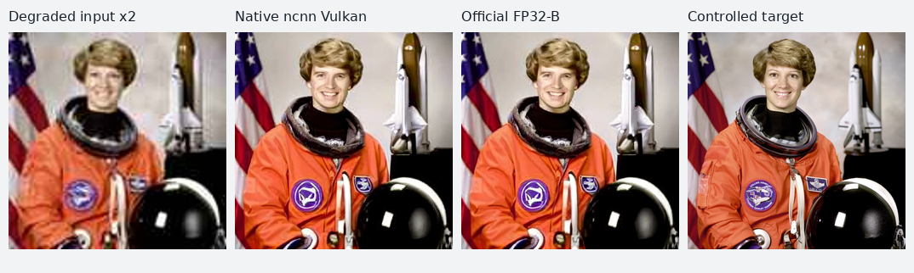

# 0.6.0 原生交付实测与已知问题

2026-09-08，按《ERNIE 移植工作总览与其他项目复用说明》的证据方法执行。当前交付是 **SeedVR2 3B 的有界原生预览**：可运行的本地 Web、独立 CLI、安装 SDK 和经过校验的模型副本。模型认证仍关闭；功能完成不覆盖下述数值与画质负结果。

证据在 [本轮 artifacts](../artifacts/2026-09-08/delivery-v1/)。报告中的实现 SHA 是各自实际执行身份。旧实验没有改写为新二进制；JPEG 修复没有改变图计算或视频读取，因此没有重跑已通过的块实验和四次视频测量。完整照片、JPEG 回归、安装 SDK 和真实 Web 任务使用修正后的共享库重新验证。

## 来源、目标和实现身份

| 项目 | 本次固定身份或范围 |
| --- | --- |
| 官方代码 | `ByteDance-Seed/SeedVR@e4de8c24441a67e1b7df56abea10645059bb1185`，保留 32 份原文及哈希 |
| 官方模型 | `ByteDance-Seed/SeedVR2-3B@37255ff8cccfb01071b87f635a5948ca8d53117c`，DiT/VAE/embedding 按官方 LFS 大小与 SHA 校验 |
| 转换器 | 独立固定 ncnn/pnnx `6a1bf000f363714839a36793addc8c879d3d899e`；pnnx SHA `732a25bf3c8e17b1d071b3eed8c6131a14da5450564bbe1a157d6dc11c2a10ba` |
| 当前运行库 | 本轮查询的官方 HEAD `3b7bdba7fc8aea8fd46779533eee027df77c639d`；归档 SHA `d9c45d475a047677e73ef9ac1dc3d80f602572261203903b12c6b01ff554a145`；未修改上游源码 |
| 参考路径 | PyTorch 2.9.0+cpu、FP32-B；实际官方数学方法体，显式替换 Apex/FlashAttention/BF16 外壳，固定原始噪声 |
| 实机 | Fedora 44 x86_64、GCC 16.2.1、RTX 4060 Laptop 8 GB、NVIDIA 595.91.07；桌面同时使用 GPU |
| 当前 SDK SHA | `a3a1e06c863bc1bb6cd83944733faaaf7e0bf96bf4adf80cd50bcda7f8eaaa4c` |
| 测量及块实验 SDK SHA | `15eff1f512192b0cc7ecdc5a1a7a9cbb531726b2133e017738cd72582423209f`，JPEG 修正前；图执行与权重读取算法未再修改 |
| 输入输出 | PNG/RGB JPEG → PNG；8 位 SDR 短片 → 无音轨 MP4；图片长边 64–512，短片 1–17 帧/长边 64–128 |

上述尺寸、层结构和协议均来自当前 SeedVR2 源码与已实施边界，没有复制 ERNIE 的验收值。图片/视频分别是 36 个图：VAE encoder/decoder、patch-in/out、32 个 DiT 块。图片包 20,439,064,743 字节，视频包 21,096,916,141 字节；安装副本已完整验证两端。

## 分项结论

| 验证类别 | 结果 | 证据与限制 |
| --- | --- | --- |
| 原生 Release 构建与安装 | PASS | CLI/Web/worker/共享 SDK；Fedora 实机构建 |
| 本地 CTest | **6/6 PASS** | `local-native-ci-final/ctest.log`；包括 JPEG 回归、有界映射 reader、核心合同、CLI、worker、CPU AWA |
| 软件 Vulkan 小算子 | **2/2 PASS** | `local-native-ci-final/mesa.json`；llvmpipe，小型 AWA，不代替大模型 GPU 验收 |
| 参考合同负向测试 | **11/11 PASS** | `local-native-ci-final/evidence-contract.log`，含逐一缺失 73 个边界的子用例 |
| CLI / 引擎参数边界 | **10/10、23/23 PASS** | 同目录 `cli.json`、`engine-boundaries.json` |
| 首次使用/包校验 | **13/13 PASS** | `native-first-use.json`，包含实际文件篡改、自签认证、Unicode 和已有输出保护；日常 CI 无大包子集为 8/8 |
| Web 合同 | **54/54 PASS** | `web.json`；HTTP/会话/工作区等，独立于模型质量 |
| 真实图片任务生命周期 | **39/39 PASS** | `image-jobs.json`、`image-job.json`；真实 JPEG、完整 worker、排队、取消、错误、下载、重启恢复 |
| 真实视频任务生命周期 | **49/49 PASS** | `video-jobs.json`、`video-job.json`；整段推理、帧数/时间戳、seek、取消、恢复等 |
| 同输入真实 DiT 块 | **旧库 4/4、新库 buffered 4/4、mapped 4/4 PASS** | `same-input-blocks-*.json`；官方 block 18/30 输出进入 block 19/31，实际 latent T=5，CPU/Vulkan；新旧块输出逐字节相同 |
| 新自然 JPEG 完整执行/数值 | **73/73 PASS，PNG 最大差 1** | `natural-jpeg-fixed-run.json`、`natural-jpeg-fixed-parity.json`；128→256、Vulkan、外部 SDK |
| 6 帧小视频历史数值重放 | **73/73 PASS** | 旧保存张量使用加固合同复核；不冒充本轮重新生成官方基线 |
| 17 帧完整 Vulkan 执行 | **4/4 执行成功，数值每次 60/73 FAIL** | 四份 `video17-*-parity.json`；所有原始中间结果与 MP4 在四次之间逐字节一致 |
| 17 帧 CPU 历史数值重放 | **70/73 FAIL** | 旧保留轨迹复核，未重复完整 CPU 大模型运行 |
| 独立安装/中文路径/禁网 | **PASS，真实完整图像执行** | `offline-delivery.json`、`offline/`；源码与原模型不可见，使用新路径和外部 CMake SDK 使用程序 |
| 任务质量 | **单例指标负结果，未通过代表性质量验收** | 见下表；自然视频质量、盲评、保留测试集尚未完成 |
| 远端原生 CI | **已建立，NOT_RUN** | Ubuntu 24.04 GCC/Clang CLI、GCC Web 工作流；当前无远端仓库/推送，未声称 GitHub Actions 已通过 |

诊断保持历史 `abs(error) <= 0.001 + 0.001 * abs(reference)`，PNG 最大整数差 ≤1。这里的 73 项由 9 个边界与 32×2 个块输出组成，名称/形状/类型固定；缺少、重复、未知边界或未审阅参考都拒绝。这个历史开发门槛尚未校准为正式模型认证策略，不能解释为官方标准。

## 自然 JPEG：定位到预处理并完成修复

新输入来自 NASA 公有领域照片的受控降质版本：先制备 256×256 目标，再缩到 128×128 并编码 JPEG quality=40、4:2:0。原文件、转换方法、Pillow 版本与哈希在 [fixture provenance](../tests/fixtures/natural/provenance.json)。来源为 [scikit-image 的官方数据说明](https://scikit-image.org/docs/stable/api/skimage.data.html#skimage.data.astronaut)。

初次整链对照仅 **2/73** 通过，`prepared` 最大差 0.0204576，输出最大差 66。原生 STB JPEG 与官方 Pillow 的解码路径不同。修复 JPEG 读取后，RGB 与灰度渐进 JPEG 均逐像素匹配保留的 Pillow 解码参考；随后只重跑受影响的完整照片，复用已经保存的独立官方轨迹。`prepared` 最大差降至 `5.96e-7`，VAE posterior `2.19e-5`，block 31 video `3.23e-4`，decoded `6.04e-5`，73 项全部通过，PNG 最大差 1。

未删除旧失败的官方报告和旧运行报告，也没有把新候选输出登记成官方 golden。完整对照参考的 SHA 是 `906d075afc26ec5a78ee53bee08aec28647ebf114406c13a6811713ab05caab0`，在人工审阅清单中绑定旧运行、模型身份和独立参考 PNG。

| 对 256×256 受控目标比较 | RGB PSNR，越高越好 | RGB SSIM，越高越好 |
| --- | ---: | ---: |
| 同尺寸 bicubic 输入基线 | 23.7858 dB | 0.756756 |
| 原生 Vulkan 输出 | 20.0088 dB | 0.677243 |
| 独立官方 FP32-B 输出 | 20.0088 dB | 0.677243 |

协议为 RGB 等权、无额外裁边、SSIM 11×11 Gaussian σ=1.5、valid 区域、总体协方差。计算脚本 [measure_image_quality.py](../tools/measure_image_quality.py) 和原始报告可复算。目视可见恢复结果轮廓更清楚，但衣服图案、脸部和局部纹理发生变化。**该照片中原生与官方一致，但对目标的像素保真度低于插值基线。** 单张图片不能构成普遍画质优劣结论，不能将锐化观感当作模型质量验收通过。

## 权重读取测量：保留 buffered 默认

同一二进制和共享库，以 ABBA 顺序执行 17 帧、128×128、seed 666、Vulkan GPU 0、FP32、4 个 CPU 线程。每次新进程，请求 Vulkan validation；没有清空文件缓存或独占桌面 GPU。采样间隔约 0.5 秒。

| 顺序 | 权重读取 | 进程墙钟 | 采样匿名 RSS 峰值 | 采样总 RSS 峰值 | 整卡显存峰值，含桌面 |
| --- | --- | ---: | ---: | ---: | ---: |
| A1 | buffered | 40.460 s | 832.15 MiB | 1071.63 MiB | 6690 MiB |
| B1 | mapped | 45.314 s | 230.35 MiB | 1009.34 MiB | 6715 MiB |
| B2 | mapped | 49.248 s | 196.86 MiB | 1031.25 MiB | 6679 MiB |
| A2 | buffered | 45.155 s | 884.18 MiB | 1124.89 MiB | 6708 MiB |

两次观测均值：buffered 墙钟 42.808 s、匿名 RSS 峰值 858.164 MiB；mapped 墙钟 47.281 s、匿名 RSS 峰值 213.605 MiB。映射把内存计账更多移到文件映射，不能把匿名 RSS 降幅称为总内存或显存降幅。mapped 两次还采样到约 43/84 MiB 进程交换区，buffered 为零；温度随实验上升、页缓存状态未受控，因此不声称有统计显著的固有速度差异。

图计算约 8.16–8.26 秒，包哈希约 14.17–18.64 秒，权重载入约 15.57–20.24 秒，其余主机等待/清理约 1.19–2.17 秒。数据指向校验与装载成本，但当前仍每次验证全部权重；没有为追求速度降低真实性检查。

| 优化 | 正确性 | 收益/代价 | 当前默认 |
| --- | --- | --- | --- |
| 逐图权重生命周期、及时释放中间激活 | 已有真实整链证据保留 | 可执行约 20 GB FP32 包；增加装载次数；不虚构本轮未测的旧全驻留收益 | 开启 |
| 每次运行共享 GPU pipeline cache | 已有图输出证据保留 | 复用着色器管线；不是权重/KV 缓存；本轮未重复基线计时 | 开启 |
| Linux 只读有界 mmap | 同输入块和四次整链输出均逐字节相同；整链旧数值失败不变 | 匿名 RSS 降低，总 RSS 降幅有限；未显示速度收益；需保持文件不变 | **关闭，显式选用** |

没有自回归 KV cache；本版跨块时序 VAE cache 关闭。权重、激活、工作区、文件缓存分别列明：激活/工作区/文件缓存的独立峰值尚未测得，报告用 null，不把 RSS/整卡 VRAM 冒充它们。外部 SDK 自然图单次原生报告总时长 48.279 s；包含校验和装载，不是稳态吞吐量。

## 保留的失败与后续边界

1. **17 帧数值仍 FAIL**：Vulkan block 19、22–31 的视频分支及 velocity/latent 共 13 项失败；旧 CPU 为 block 29–31 共 3 项。用相同官方上游输入后，抽查的 block 19/31 CPU/Vulkan 都通过，支持误差传播的定位方向，但尚不能声称根因全部解决。最终 decoded 通过不能掩盖中间失败。
2. **画质没有正式认证**：本次新增单张自然照片，指标为负；原有测试视频为合成图案。缺自然运动、镜头切换、重复纹理、时序稳定性、盲评和冻结的保留集。
3. **官方 BF16/Apex/FlashAttention 路径 A 未执行**：目前保留的官方参考是 CPU FP32-B。7B、低精度、高分辨率、流式时间缓存、长片和音频不是当前交付功能。
4. **跨机原生资格尚有限**：当前实测 Fedora/NVIDIA 和软件 Vulkan。AMD/Intel 真机、Windows/macOS、远端 Ubuntu CI 未执行。缺少设备时记未测/跳过理由，不能换用其他设备宣称目标平台通过。
5. **已修复并保留的交付失败**：Fedora `lib64` 被硬编码 `lib` 漏掉，现由 GNUInstallDirs 决定相对库路径；CI 误选 i686 Vulkan ICD，现按本机架构选取；首次离线命名空间挂载布局失败，修正后两次实际成功；JPEG 预处理失败如上。相关原始报告仍在 artifacts。
6. **发行边界**：本地安装、独立模型副本、可复现来源与文档已准备。仍依赖当前系统 ABI，未宣称通用便携二进制。第三方许可原文随安装保存；项目自身公开许可决定、完整外部分发审核和公开发布尚未执行。没有创建远端仓库、推送或发布 Discussion。

继续工作应优先解决明确的使用需求和现存数值问题。已经通过的实验仅在相关实现修改或有新疑问时重跑；无需先完成全部研究性优化才能使用这个有边界的预览。
