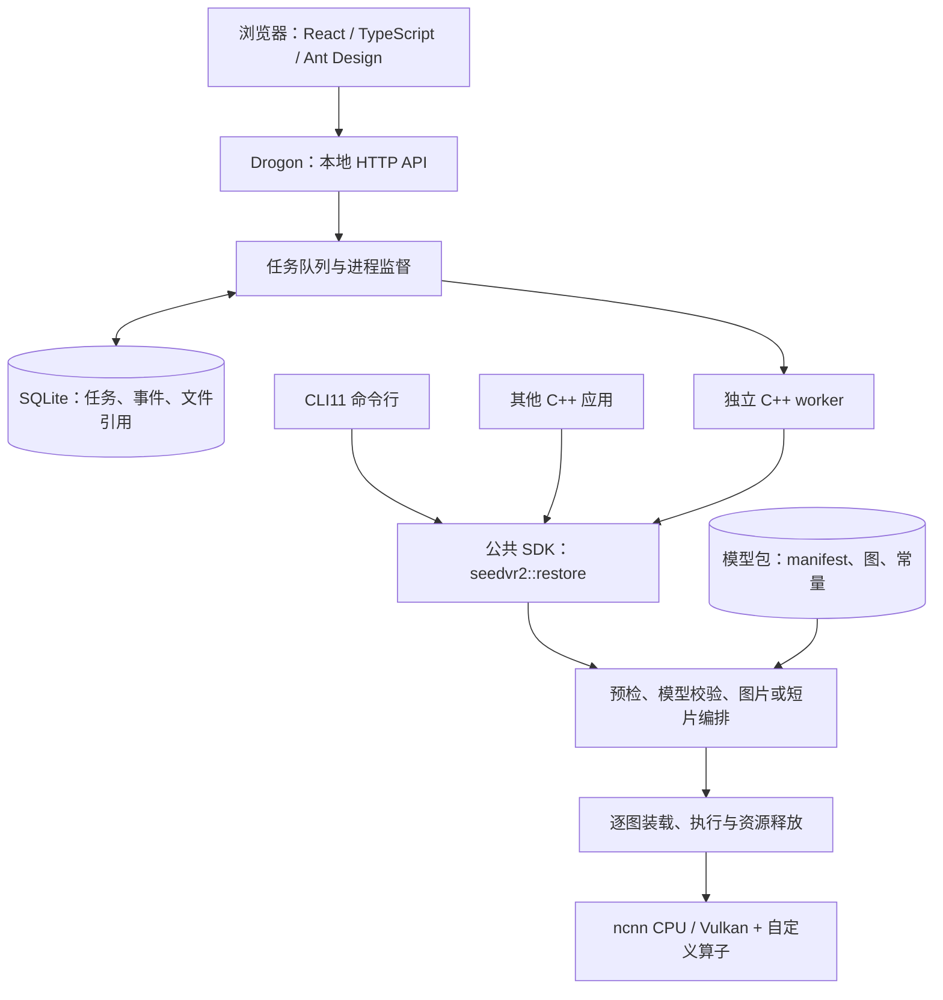
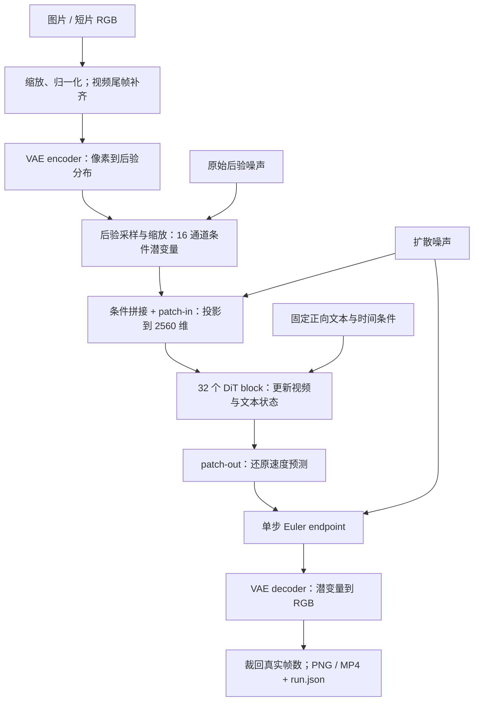

# SeedVR2 3B 图片与短视频修复：原生 C++ / ncnn / Vulkan 移植

> 已于 2026-09-10 发布到 Tencent/ncnn 的 Show and tell：[Discussion #6991](https://github.com/Tencent/ncnn/discussions/6991)。下文为已发布正文，保留原文件路径以兼容已有链接；数值修复及远端 CI 在提交 `7e56479` 核验。[发布记录](DISCUSSION-PUBLICATION.json)。

[SeedVR2 ncnn Vulkan](https://github.com/mingshi2333/seedvr2-ncnn-vulkan) 于 **2026 年 9 月 6 日** 开始开发，使用 C++20 和 ncnn 实现 SeedVR2 3B 的本地推理，支持 Vulkan 加速，可用于图片与短视频修复。提供独立 CLI、本地 Web 界面和可安装的 C++ SDK，输出 PNG、MP4 及 JSON 运行报告。模型准备完成后可离线使用，推理无需 Python。

移植包含官方权重转换、自定义算子、原生推理流水线和应用交付。当前验证配置为 **3B、FP32-B、单步、CFG=1**。

## 应用架构与技术栈

应用围绕三个需求组织：浏览器操作方便、命令行便于批量测试、其他 C++ 程序能够直接调用。三个入口共用原生 SDK，模型计算集中在同一套实现中。Web 的任务状态与模型执行分开，转换工具则在准备模型时单独运行。

| 部分 | 技术选择 | 在项目中的职责 |
| --- | --- | --- |
| 本地界面 | React、TypeScript、Ant Design | 导入图片/视频、设置参数、查看任务、对比与下载结果；React Router 管理页面，TanStack Query 查询和刷新任务状态 |
| HTTP 服务 | Drogon / C++ | 提供本地 API、会话校验、媒体及结果访问，并向浏览器提供已打包的静态页面 |
| 任务与存储 | C++ 任务服务、独立 worker、SQLite | 排队、进程监督、取消、任务状态与事件持久化；图片和视频保存在工作区，数据库记录其引用 |
| 命令行与公共接口 | CLI11、C++20 SDK | 解析参数，提供预检、推理、模型验证/复制、进度与取消接口；CLI 与外部应用调用同一实现 |
| 模型执行 | ncnn CPU / Vulkan、GLSL / SPIR-V | 执行标准网络层，以及 SeedVR2 的 AWA、时序 VAE 和 FP32 数值适配层 |
| 媒体处理 | FFmpeg 库、libjpeg、stb | 视频解码与编码、JPEG/PNG 读写；布局、缩放、噪声与采样由 C++ 处理 |
| 模型准备 | Python、PyTorch、pnnx | 下载固定版本的官方权重，导出组件、映射自定义层、组装模型包，并生成官方参考 |
| 构建与安装 | CMake、Ninja、Vite | 编译原生程序和 SDK，构建并内嵌前端资源，导出可供其他 C++ 工程链接的安装包 |



前端经 Vite 构建后内嵌到 C++ Web 程序中，安装后由同一个本地服务提供页面和 API，运行时不需要 Node。Python、PyTorch 和 pnnx 用于模型准备与参考验证，实际推理由 C++ SDK 执行。只需要 CLI 时可以关闭 Web 构建，不引入 Drogon 和前端构建步骤。

### 一次 Web 任务如何执行

用户导入文件后，服务保存媒体并分配 ID；提交参数时创建任务，SQLite 同时记录请求和状态。当前最多保留 **8 个未完成任务，同时执行 1 个**，控制多个大模型任务对显存和 RAM 的竞争。

任务服务为当前任务写入请求文件，启动独立 worker。worker 调用 `seedvr2::restore`，通过逐行 JSON 消息返回进度、结果或错误。服务校验消息并持久化事件，浏览器定期查询任务状态；刷新页面可以继续查看同一个任务。只有 worker 正常退出、报告包含完整阶段且输出文件身份核对成功，任务才标记为完成。

取消由服务通知并监督 worker 退出。服务重启后，尚未完成的任务记为 `INTERRUPTED`，保留原因；用户重试时创建一次新的完整运行。这里恢复的是任务记录，没有从某个 DiT block 继续计算的断点恢复功能。进程监督实现和已验证的交付平台目前是 Linux。

### 公共 SDK 与职责边界

公共入口定义在 [`include/seedvr2/pipeline.hpp`](https://github.com/mingshi2333/seedvr2-ncnn-vulkan/blob/main/include/seedvr2/pipeline.hpp)：`RestoreRequest` 描述输入、模型、输出目录、设备和内存策略，`preflight` 做预检，`restore` 执行图片或短片修复；`verify_model` 和 `copy_model` 负责模型校验与离线复制。进度与取消使用回调，返回值包含输出文件、运行报告或明确错误。

公共头文件使用标准 C++ 类型，不要求调用方引入 ncnn、CLI11 或 JSON 库。CLI 负责参数和终端输出，Web worker 负责进程消息，SDK 负责实际计算。外部工程通过 `find_package(seedvr2 0.7 CONFIG REQUIRED)` 和 `seedvr2::sdk` 链接安装后的同一套库；测试程序也走这个入口。

## 模型转换与原生推理

模型包按 **VAE encoder → patch-in → 32 个 DiT block → patch-out → VAE decoder** 拆成 **36 个 ncnn 图**。这样可以用官方中间输入单独重放一个组件，也可以随阶段装载和释放权重。C++ 流水线负责连接组件，并实现布局、后验采样、条件拼接和 Euler 更新。



当前 3B 的关键关系如下，模型尺寸与调度均来自 SeedVR2 本身：

| 组件或边界 | 当前结构与作用 |
| --- | --- |
| 时序 VAE | 16 通道潜变量，空间压缩 8 倍、时间压缩 4 倍；保留因果卷积和首帧规则 |
| DiT 条件 | 16 通道扩散噪声 + 16 通道采样后验 + 1 通道掩码，共 33 通道；使用 `1×2×2` patch |
| DiT 主干 | 32 个 block，hidden 2560，20 个注意力头，每头 128 维；视频与文本状态逐块更新 |
| 文本条件 | 模型包自带固定的 `58×2560` 正向文本条件，当前用户接口不接受自由文本提示 |
| 输出 | patch-out 还原 16 通道速度预测，Euler 更新后由 VAE 解码为像素 |

图片使用单帧路径。视频在整个短片的潜变量上联合处理，保留时间轴上的 VAE 卷积和 3D attention。例如 8 帧先重复尾帧补到 9 帧，VAE 得到 3 个潜变量时间位置，解码后裁回 8 帧。当前跨片段 VAE cache 关闭，整段短片的输入、补齐和输出裁剪均写入报告。

### AWA 如何导出和执行

AWA（adaptive window attention）的窗口随实际时间、空间网格变化。导出时通过 pnnx `moduleop` 保留模块边界，再检查属性、输入输出、归一化权重和 RoPE 频率，将节点映射为 `SeedVR2AWA`。运行时根据实际形状生成窗口索引。

每次 AWA 计算包含三步：

1. 生成 regular/shifted 的裁剪窗口；shifted 使用半窗口偏移并裁剪边界。
2. 每个窗口收集视频 Q/K/V，重复加入完整文本 Q/K/V，再执行 Q/K RMSNorm、多模态 3D RoPE 和联合注意力。
3. 视频结果写回对应位置，文本结果在全部窗口之间等权平均。

Vulkan 复用锁定 ncnn 的 SDPA QK/PV 着色器，配合项目的 FP32 softmax、gather/scatter 和文本归约。时序 VAE 的变换与卷积也由原生层处理。请求 Vulkan 时检查实际层支持和算术能力，不满足条件会返回错误。编解码、布局、噪声和 Euler 在主机执行，当前图间张量会下载后再上传到下一图。

转换路径为 **官方实现与权重 → PyTorch / TorchScript → pnnx → 自定义层映射 → `.param/.bin` 与常量组成的模型包 → 原生 CPU/Vulkan**。运行库固定为 ncnn `3b7bdba7fc8aea8fd46779533eee027df77c639d`，pnnx 导出单独固定为 `6a1bf000f363714839a36793addc8c879d3d899e`；分配器适配与实际加载库的身份另记入报告。[AWA 导出](https://github.com/mingshi2333/seedvr2-ncnn-vulkan/blob/main/tools/export_awa.py) / [真实 DiT block 导出](https://github.com/mingshi2333/seedvr2-ncnn-vulkan/blob/main/tools/export_dit_block.py)。

## 内存、模型包与资源生命周期

FP32 图文件包约 20 GB，执行器一次装载一个图：检查图结构、查询预算、选择权重放置、执行、取回必要输出，再销毁 Net 和分配器。相邻图复用必要的输出，本次运行共享着色器 pipeline cache。代价是逐图文件读取、装载和主机/GPU 传输。

`auto / device / host` 控制 Vulkan 权重放置。自动模式在每次图装载前重新查询显存预算，按图文件大小估算权重准备空间并预留余量；预算不足或查询不可用时选择主机可见内存。`host` 权重仍用于 Vulkan 计算，实际内存类型与驻留由驱动决定。报告保留请求的策略、选择原因和预算快照。这里的估算针对权重，尚未实现激活/工作区的自动卸载或 OOM 自动重试。

默认缓冲读取权重，也可使用只读 `mmap`；映射保持到对应 Net 销毁之后。当前模型没有自回归 KV cache，也没有跨任务常驻的整包权重缓存。[内存策略与测量](https://github.com/mingshi2333/seedvr2-ncnn-vulkan/blob/main/docs/MEMORY-VALIDATION.md)。

模型包独立于应用安装，manifest 记录图、常量、采样设置与来源。预检先检查参数、媒体几何、输出空间、设备和包身份，实际运行再校验全部权重哈希；离线复制校验两端，成功后再发布目标目录。每份 `run.json` 绑定输入、模型 manifest、转换器、运行库，以及可执行文件和实际加载 SDK 的身份。相同输入数值验证还绑定两份原始噪声，任务画质另用目标和基线评估。

## 代码组织

| 修改内容 | 主要源码入口 |
| --- | --- |
| 公共 API 与外部集成 | `include/seedvr2/pipeline.hpp`、`examples/sdk` |
| CLI / Web / worker | `apps/cli`、`apps/studio`、`apps/server`、`apps/worker` |
| 任务队列、监督与持久化 | `src/jobs/service.cpp`、`src/jobs/process.cpp`、`src/storage/workspace.cpp` |
| 图片与短片编排 | `src/engine/ncnn/pipeline.cpp`、`image.cpp`、`video.cpp` |
| 图执行和资源管理 | `src/engine/ncnn/inference.hpp`、`graph.hpp`、`weight_io.hpp`、`memory.hpp`，以及 `src/runtime/memory_policy.cpp` |
| 自定义算子与数值适配 | `src/engine/ncnn/awa.cpp`、`video_layers.cpp`、`rms_norm.cpp`、`linear.cpp`、`softmax.cpp`、`shaders` |
| 模型转换和数值重放 | `tools/export_*.py`、`tools/pipeline_contract.py`、`tools/pipeline_replay.py` |
| 构建、安装与 CI | `CMakeLists.txt`、`cmake`、`.github/workflows/native.yml` |

公共 API、任务服务、模型数学、图执行和包管理分别承担自己的职责。可以从 CLI 或外部 SDK 程序直接重现问题，再按组件定位；Web 层负责提交和展示结果。更细的调用边界见[架构与源码导航](https://github.com/mingshi2333/seedvr2-ncnn-vulkan/blob/main/docs/ARCHITECTURE.md)。

## 对照结果

Linux x86_64，RTX 4060 Laptop 8 GiB，约 32 GiB RAM。对照使用锁定官方数学实现的 CPU FP32-B 参考，共享**原始后验噪声和扩散噪声**，逐元素检查全部 73 个张量边界。

| 测试输入 | 后端 / 输出 | 完整数值结果 |
| --- | --- | --- |
| 自然运动 9 帧 | Vulkan，128×80 | 原 63/73 → **73/73** |
| 尾帧补齐 8 帧 | Vulkan，128×80 | 原 71/73 → **73/73** |
| 人工镜头切换 17 帧 | Vulkan，128×80 | **73/73** |
| 合成运动 17 帧 | CPU / Vulkan，128×128 | 两条轨迹均 **73/73** |
| 自然 JPEG | Vulkan，256×256 | **73/73**，RGB8 最大差 1 |

本轮没有修改官方参考、权重、原始噪声或 `atol=rtol=0.001` 的历史全链门槛。误差定位用相同输入的真实组件回放，修复了 VAE 分块卷积和 shortcut bias 顺序、归一化、注意力中的 FP32 舍入，以及 DiT 长点积的误差补偿。还抓到并修复了 CPU 留出视频的 72/73 回归。失败候选和诊断记录都保留在[数值修复报告](https://github.com/mingshi2333/seedvr2-ncnn-vulkan/blob/main/docs/NUMERICS-REPAIR.md)。

下面四列依次为 **bicubic → 原生 ncnn/Vulkan → 官方 FP32-B → 固定目标**；来自实际输出，没有额外增强。


完整张量对照通过之后，画质仍需单独看。三段低分辨率开发视频的原生 PSNR 为 **20.01 / 19.70 / 23.24 dB**，bicubic 为 **26.93 / 26.82 / 26.80 dB**；SSIM 也较低，官方 FP32-B 在这些样例上有相同表现。这些素材来自同一来源和固定人工退化，不是代表性画质基准。[全部图、视频与逐帧数据](https://github.com/mingshi2333/seedvr2-ncnn-vulkan#实测结果与对照图)。

## 使用与当前边界

项目采用**源码构建 → 官方权重下载 → 本机转换 → 原生校验 → CLI / 本地 Web 运行**的使用流程，不以预编译程序或转换模型 Release 为前提。官方 `.pth` 需要先转换为包含 36 个 ncnn 图的模型包；转换完成后，兼容环境中的推理无需 Python，也可以离线使用。

安装[教程中的构建依赖](https://github.com/mingshi2333/seedvr2-ncnn-vulkan/blob/main/docs/TUTORIAL.md)及 `uv` 后，命令行入口为：

```sh
python3 tools/build_native.py --cli-only --check
python3 tools/build_native.py --cli-only --jobs 2 --prefix dist/tutorial
bash tools/convert_models.sh --check image models/image dist/tutorial/bin/seedvr2
bash tools/convert_models.sh image models/image dist/tutorial/bin/seedvr2
```

需要 Web 时去掉 `--cli-only`，并准备 Node.js 24 与 npm。视频转换使用 `video models/video`，指定新的输出目录。下载脚本锁定官方 revision，支持续传和 SHA-256 校验；转换入口准备私有导出环境，显式传给 pnnx，保留中间结果和失败阶段日志，最后调用原生模型校验。转换阶段暂不自动续跑，新脚本的独立 Ubuntu 完整流程尚未通过验收。[使用、失败处理与离线搬移](https://github.com/mingshi2333/seedvr2-ncnn-vulkan/blob/main/docs/LOCAL-CONVERSION.md)。

普通 CI 检查构建、算子和应用接口，不下载大模型；完整官方权重转换、首次执行与隔离网络回放是独立手动工作流，不创建 Release。原发布工作流因访问未公开模型返回 404，其构建已通过，但首次推理未执行；不把这次失败计作模型数值失败或完整交付通过。

应用已包含参数预检、Unicode 路径、进度与取消、模型身份/完整性校验、离线模型复制和安装 SDK。本机原生测试 **36/36**。Mesa 的小型测试为 **10 项通过、12 项能力跳过**：本机 llvmpipe 不保留这些补偿算子要求的 FMA 残差，程序会在模型加载前明确拒绝。能力探测和数值验收分开；大模型实机证据不由 CI 小型测试替代。

提交 `7e56479` 的 Ubuntu GCC CLI、Clang CLI、GCC Web 远端 CI 全部通过：每项原生套件 **24 项通过、12 项能力跳过**，Web 另有 **54/54** 接口检查。[下载归档的原始报告](https://github.com/mingshi2333/seedvr2-ncnn-vulkan/blob/main/artifacts/2026-09-10/github-ci-numerics-v2/README.md)保留依赖日志、安装验证和跳过原因；远端 CI 没有运行完整 3B 权重。

当前图片输出长边 ≤512；视频 ≤17 帧、长边 ≤128，输出无音轨 SDR MP4。官方 CUDA BF16/Apex/FlashAttention 默认路径、更高分辨率、长片、音轨、更多设备和代表性时序画质仍是后续工作。[具体缺口与验收范围](https://github.com/mingshi2333/seedvr2-ncnn-vulkan/blob/main/docs/CURRENT-GAPS.md)。

希望交流两个实现问题：如何在不同 Vulkan 驱动上可靠地保留补偿算法需要的 FMA 行为；以及在保留同输入数值证据的前提下，怎样减少这类逐图大模型执行的权重装载和图间传输成本。欢迎带设备、驱动、参数与 `run.json` 的复现报告。
