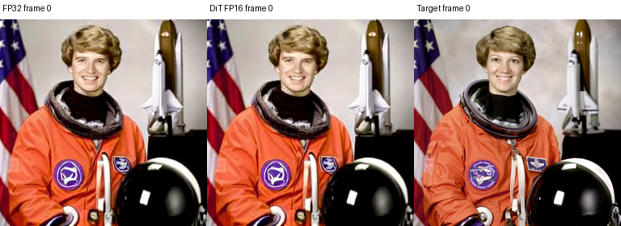
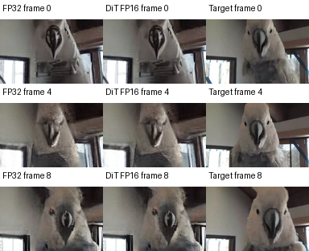
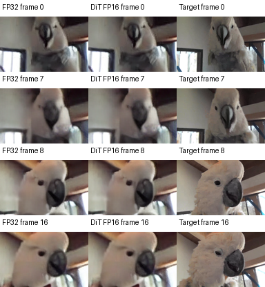

# SeedVR2 3B：DiT FP16 权重存储

已接通 **32 个 DiT 块的 IEEE FP16 线性权重存储**。ncnn 加载时展开为 FP32，CPU/Vulkan 计算与激活保持 FP32；VAE、patch projection、bias、调制常量和 AWA 属性保持原值。它降低模型下载和磁盘占用，不等于 INT8、BF16 或全 FP16 算术，也不承诺显存减半。

## 设计与使用边界

[包转换工具](../tools/convert_dit_storage_package.py)先验证原 FP32 包的审阅身份和所有文件，再按[已知 DiT 权重布局](../tools/dit_weight_storage.py)转换矩阵。图片与视频复用同一份 32 块权重；每个候选使用独立 profile 和有效载荷哈希。CLI、Web worker 和 SDK 共用包加载器，运行报告同时记录存储、激活和算术精度。

文件变小后，加载仍产生 FP32 权重。因此逐图内存策略先按最多两倍存储字节估算展开大小，再套用现有内存余量；没有使用压缩文件大小直接代替运行时权重需求。保留原来的 GPU/RAM 自动放置逻辑。

| 包 | FP32 | DiT FP16 存储 |
| --- | ---: | ---: |
| 图片图文件 | 约 20.44 GB | 约 10.39 GB |
| 视频图文件 | 约 21.10 GB | 约 11.05 GB |
| 图片 + 视频去重对象 | 21.44 GB | **11.40 GB** |

这里使用十进制 GB。最终安装还有常量与 manifest 小量开销，以下载计划给出的精确字节为准。图片和视频若分别完整安装，不自动共享文件；发布对象和维护者打包目录按内容去重。

## 完整执行与数值偏差

Linux x86_64、RTX 4060 Laptop 8 GiB、主机内存约 32 GiB。固定官方 3B 来源、单步 CFG=1、相同输入与原始噪声。每条执行都核验完整 73 个模型边界，并检查额外的 noise、posterior-noise、patches 和 patch-out 张量；缺失、形状变化、身份变化或非有限值会使测量失败。

量化相对 FP32 的误差按独立报告记录。旧 FP32 绝对/相对误差阈值保留为描述数据，**不作为低精度接受门槛**，没有通过改变旧门槛来重新标注历史结果。

| 实测案例 | 后端 | 相对原生 FP32 的逐帧 PSNR | 最低 SSIM | 墙钟时间 |
| --- | --- | ---: | ---: | ---: |
| 256×256 自然图片 | Vulkan | 40.03 dB | 0.99158 | 27.56 s |
| 128×80，自然运动 9 帧 | Vulkan | 61.96–64.32 dB | 0.99986 | 23.84 s |
| 128×80，尾帧补齐 8 帧 | Vulkan | 62.50–64.25 dB | 0.99987 | 23.86 s |
| 128×80，人工镜头切换 17 帧 | Vulkan | 66.48–67.86 dB | 0.99993 | 29.15 s |
| 256×256 自然图片 | CPU | 40.03 dB | 0.99158 | 44.30 s |

以上五条完整执行输出有限，分别记录 73/73 个边界的误差；这不是“73/73 个边界通过 FP32 门槛”。[完整摘要](../artifacts/2026-09-13/precision-full/final/summary.json)链接逐边界最大绝对误差、RMSE、MAE、旧阈值超限元素数，以及官方 FP32-B / 原生 FP32 两组参照。视频保真比较使用编码前 RGB8，排除补齐后裁掉的帧。

时间为单次观察，包含验证、装载、计算及输出；当时有后台模型传输，没有冷缓存控制或重复分布，因此不声称速度提升。资源 JSON 记录各阶段时间、进程 RSS 和整卡显存采样，整卡数据包含桌面进程，不能作为模型独占显存。未实施低精度 GPU 运算或激活压缩。

## 任务质量与对照图

相对 FP32 的保真度与相对固定目标的修复质量分开报告。下表采用 RGB PSNR，视频为逐帧均值。

| 固定目标样例 | FP32 | DiT FP16 存储 |
| --- | ---: | ---: |
| 自然图片 | 20.0184 dB | 20.0093 dB |
| 自然运动 9 帧 | 20.0078 dB | 20.0074 dB |
| 尾帧补齐 8 帧 | 19.6978 dB | 19.6987 dB |
| 镜头切换 17 帧 | 23.2410 dB | 23.2414 dB |

这些是开发样例，三段视频来自同一素材，镜头切换为人工拼接。没有代表性质量门槛，也不能把末位波动宣称为提升。既有单步模型相对 bicubic 的部分任务质量负结果仍见 README 的原始实测。







[逐帧质量报告](../artifacts/2026-09-13/precision-full/final/quality/cut-17/report.json)还记录相邻帧误差残差变化，镜头切换单独列出；该统计没有运动补偿，不能单独证明没有闪烁。

## 获取与运行

Hugging Face 模型和固定版本下载入口正在做远端字节回读与安装验证；验证完成后更新本节。源码转换仍可复现，Python/PyTorch/pnnx 只用于准备和参考，原生执行不需要它们。

```sh
# 在已有审阅 FP32 图片包和导出 Python 环境的维护者机器上：
.venv-export/bin/python tools/convert_dit_storage_package.py \
  --source models/image-fp32 --output models/image-dit-fp16
.venv-export/bin/python tools/convert_dit_storage_package.py \
  --source models/video-fp32 --output models/video-dit-fp16 \
  --shared-image models/image-dit-fp16
```

转换工具不自动签发模型认证或修改审阅哈希。随项目发布的固定模型身份由原生构建和下载目录共同校验；未知产物仍需审阅。

## 验证与限制

36 项本机 CTest 通过，其中包括压缩存储展开后的内存预算测试；新增 15 项 Python 测试通过，包括权重转换异常、下载入口固定版本/目录身份和“量化偏差应记录而非否决”的协议测试。普通 CI 增加这些小型检查，大模型实测单独归档。

本轮完整实测为图片 CPU/Vulkan、上述短片 Vulkan。没有将此结果外推为全部 CPU 视频尺寸或 AMD/Intel 真机验证，也没有新增无限分辨率、长视频、音轨、流式时间缓存、INT8 或 BF16 运算能力。
