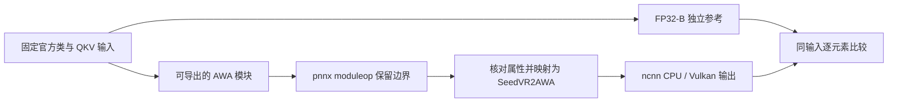

# 从官方 SeedVR2 到 ncnn 原生应用

这是一个面向已有 C++、PyTorch 和基本 Vulkan 经验读者的**进阶移植教程与可执行案例**。
学习目标是理解模型拆分、张量布局、pnnx 自定义边界、CPU/Vulkan 同输入对照，以及原生应用交付。
当前范围为 SeedVR2 **3B / FP32-B / Linux**。本教程不是完整 Vulkan 入门课，也不承诺生产级长视频修复。

首次克隆得到的是源码、小型夹具和历史报告，**没有**维护者本机的 `dist/`、`.deps/`、Python 环境或完整模型。
所有命令从仓库根目录运行，输出目录为空或不存在。先完成第 1 课，再决定是否投入完整模型导出的时间和空间。

| 课程 | 你会得到什么 | 大模型下载 |
| --- | --- | --- |
| 1. 构建与第一项实验 | 安装 CLI/SDK，运行真实 ncnn AWA 自测 | 不需要 |
| 2. AWA 的导出边界 | 独立官方参考 → TorchScript/pnnx → 自定义 ncnn 层 | 不需要；需要开发用 PyTorch |
| 3. 一个真实 DiT 块 | 官方 checkpoint 同输入组件对照 | 约 14.57 GB 官方文件 |
| 4. 完整图片流水线 | 36 图图片包、PNG 与运行报告 | 导出图约 20.44 GB，另有中间文件 |
| 5. 时序视频流水线 | 时序 VAE、三维 AWA、可播放短片 | 视频包约 21.10 GB，DiT 可硬链接复用 |
| 6. 验证与交付 | SDK、离线复制、分项证据和优化分析 | 复用已准备文件 |

包大小不是峰值磁盘/RAM 需求。官方 checkpoint、TorchScript/pnnx 中间文件、参考张量和独立安装副本会额外占用空间。
仅前三类已知文件就可能超过 50 GB；不要按单个模型包大小预留导出空间。当前没有跨设备的导出峰值资源保证。

## 1. 从干净克隆开始

```sh
git clone https://github.com/mingshi2333/seedvr2-ncnn-vulkan.git
cd seedvr2-ncnn-vulkan
```

Ubuntu 24.04 的原生开发依赖如下；这也是 GitHub CI 使用的平台。其他 Linux 发行版使用等价开发包。
CPU 执行仍需 Vulkan 开发库，因为当前 SDK 包含 Vulkan 后端；没有独立显卡可先做 CPU 自测。

```sh
sudo apt-get update
sudo apt-get install -y build-essential cmake ninja-build python3 python3-venv \
  pkg-config ripgrep libssl-dev libjpeg-dev libsqlite3-dev libvulkan-dev \
  glslang-dev glslang-tools spirv-tools mesa-vulkan-drivers vulkan-validationlayers \
  libavformat-dev libavcodec-dev libavutil-dev libswscale-dev libomp-dev \
  uuid-dev zlib1g-dev

python3 tools/build_native.py --cli-only --check
python3 tools/build_native.py --cli-only --jobs 2
```

准备脚本按锁文件下载并校验依赖；构建器编译 ncnn、SDK/CLI/worker，执行小型 CTest，然后安装到 `dist/tutorial`。
失败会停止并保留之前步骤和日志，不报告安装成功。这个步骤不下载任何模型权重。
`--plan` 只打印命令；`--offline` 只使用已有依赖归档（Web 构建还需 npm 缓存）。
`--check` 只做主机依赖初检，不代表链接、GPU 或推理已通过。

第一次实验：

```sh
dist/tutorial/bin/seedvr2 version
dist/tutorial/bin/seedvr2 engine self-test --backend cpu
dist/tutorial/bin/seedvr2 engine devices
dist/tutorial/bin/seedvr2 engine self-test --backend vulkan --gpu 0
```

CPU 自测使用仓库内嵌的普通/移位 AWA 夹具，输出 JSON 应为成功且没有误差越界。
Vulkan 自测必须显示实际 Vulkan 执行；找不到设备就是能力缺失，不能记成通过。
软件 Vulkan 可以验证小算子执行，不证明离散显卡速度或 3B 模型可用。

阅读 [窗口规划](../src/planning/windows.cpp)、[AWA 实现](../src/engine/ncnn/awa.cpp)
和 [内嵌夹具来源](../tests/fixtures/awa/provenance.json)。解释为什么视频 token 与文本 token 的聚合规则不同。

## 2. 看清自定义 AWA 如何导出

开发导出使用 Python 3.13 / PyTorch 2.9.0+cpu，与应用运行时分开。以下命令使用已安装的 `uv`
创建私有环境；`uv` 可能下载 Python，PyTorch 和锁定依赖也需要网络。普通用户运行原生程序不需要这个环境。

```sh
uv venv --python 3.13 .venv-export
uv pip install --python .venv-export/bin/python torch==2.9.0+cpu \
  --index-url https://download.pytorch.org/whl/cpu
uv pip install --python .venv-export/bin/python -r tools/export-requirements.lock.txt
python3 tools/prepare_pnnx.py --jobs 2

.venv-export/bin/python tools/generate_awa_reference.py \
  --quick --output .cache/tutorial/awa-reference
.venv-export/bin/python tools/export_awa.py \
  --suite .cache/tutorial/awa-reference/suite.json \
  --pnnx .deps/bin/pnnx --output .cache/tutorial/awa-export
.venv-export/bin/python tools/check_awa.py \
  --binary dist/tutorial/bin/seedvr2 --suite .cache/tutorial/awa-export/suite.json \
  --output .cache/tutorial/awa-native --report .cache/tutorial/awa-report.json \
  --validation-layer
```

没有可用 Vulkan 设备时显式加 `--backends cpu`，并将结论写成 CPU 验证。
完整合成套件可在另一个空输出目录去掉 `--quick` 生成，不需要重复已通过的小套件来凑数量。

沿着下面的边界阅读源码：



| 要学的关系 | 源码入口 |
| --- | --- |
| 官方方法体与显式 FP32 适配 | [awa_reference.py](../tools/awa_reference.py) |
| 可导出模块、元数据和两路 QKV | [awa_export_module.py](../tools/awa_export_module.py) |
| 保留 moduleop、严格匹配属性与 lowering | [export_awa.py](../tools/export_awa.py) |
| gather、RMSNorm、RoPE、joint attention、scatter、文本平均 | [awa.cpp](../src/engine/ncnn/awa.cpp)、[shaders](../src/engine/ncnn/shaders) |
| 参考与候选哈希、形状、有限值、误差和后端 | [check_awa.py](../tools/check_awa.py) |

练习：在你自己的参考输出副本中改动一个文件，确认校验拒绝它；不要改动官方原文或已保存的 golden。
AWA 的数值通过不代表 VAE、DiT 整块或完整模型通过。

## 3. 从一个真实组件开始

先查看下载来源和大小，再下载官方文件：

```sh
python3 tools/prepare_models.py --list
python3 tools/prepare_models.py
```

来源固定在 `model-sources.lock.json`，下载到 `.cache/models`。脚本支持断点续传和最终 SHA-256 校验，
已验证文件不会重新下载；`--offline` 仅校验已有完整文件。下载的是官方 checkpoint，还不能直接交给 ncnn。
导出教程使用默认位置；若下载到其他磁盘，需按各导出工具的参数指定 checkpoint，并留意图片打包器仍读取默认模型目录。

先导出第 16 块，它属于后段共享权重块：

```sh
.venv-export/bin/python tools/export_dit_block.py \
  --pnnx .deps/bin/pnnx --blocks 16 --output .cache/tutorial/dit-one
.venv-export/bin/python tools/check_graph.py \
  --binary dist/tutorial/bin/seedvr2 --suite .cache/tutorial/dit-one/suite.json \
  --output .cache/tutorial/dit-one-native --report .cache/tutorial/dit-one-report.json \
  --validation-layer
```

比较的两路输入是视频、文本，还包括同一个时间调制张量。输出也有视频/文本两路。
学习 [完整块导出](../tools/export_dit_block.py) 中对 Reshape、常量、AWA 属性的严格匹配：
未知图结构应报错，不能靠扩大字符串替换范围“修好”导出。
首 10 块与后段共享块不同；一个块通过不意味着全部 32 块已经验证。

## 4. 接通图片的 36 张图

复用已经导出的第 16 块，补全其他块和图片 VAE：

```sh
.venv-export/bin/python tools/export_dit_block.py --pnnx .deps/bin/pnnx \
  --blocks 0,1,2,3,4,5,6,7,8,9,10,11,12,13,14,15,17,18,19,20,21,22,23,24,25,26,27,28,29,30,31 \
  --output .cache/tutorial/dit-rest
.venv-export/bin/python tools/export_vae_image.py \
  --pnnx .deps/bin/pnnx --output .cache/tutorial/vae-image
.venv-export/bin/python tools/check_graph.py \
  --binary dist/tutorial/bin/seedvr2 --suite .cache/tutorial/vae-image/suite.json \
  --output .cache/tutorial/vae-image-native --report .cache/tutorial/vae-image-report.json \
  --validation-layer
.venv-export/bin/python tools/export_image_package.py \
  --pnnx .deps/bin/pnnx --vae .cache/tutorial/vae-image \
  --blocks .cache/tutorial/dit-one --blocks .cache/tutorial/dit-rest \
  --output .cache/tutorial/image-package
```

打包器使用硬链接：导出目录和包目录须位于同一文件系统。它只在完成后写入 `manifest.json`。
普通运行会验证包的有效载荷身份与每个文件。不同工具链造成未知有效载荷时，记录差异并按贡献流程审阅，
不要删掉身份检查或把新哈希自动加入允许列表。`exporter` 元数据变化本身不会改变审阅有效载荷。

```sh
dist/tutorial/bin/seedvr2 models verify --kind image --model .cache/tutorial/image-package
dist/tutorial/bin/seedvr2 run --model .cache/tutorial/image-package \
  --input tests/fixtures/natural/astronaut-degraded.jpg --output .cache/tutorial/image-result \
  --size 256 --backend vulkan --gpu 0 --seed 666
```

成功后检查 `output.png`、`comparison-input.png` 和 `run.json`。可以先加 `--check` 预检，
但 `READY_FOR_WEIGHT_VERIFICATION` 只表示允许进入权重校验，不代表已执行推理。
这张 NASA 测试图的历史全参考画质结果并不好；该例用于观察推理与对齐，不能拿单图“更锐”证明质量提升。

完整同输入数值协议在 [image-runtime.md](image-runtime.md) 和 [pipeline_contract.py](../tools/pipeline_contract.py)。
保存候选诊断张量需显式 `--diagnostic-tensors`，会额外占磁盘。独立参考复核需要相同的实际噪声张量；
PyTorch 与 C++ 使用相同 seed 不保证同一个随机序列。官方历史大张量未上传 Git，报告中的维护者路径不能在新机器直接使用。

## 5. 视频不是逐帧调用图片模型

```sh
.venv-export/bin/python tools/export_vae_video.py \
  --pnnx .deps/bin/pnnx --output .cache/tutorial/vae-video
.venv-export/bin/python tools/check_graph.py \
  --binary dist/tutorial/bin/seedvr2 --suite .cache/tutorial/vae-video/suite.json \
  --output .cache/tutorial/vae-video-native --report .cache/tutorial/vae-video-report.json \
  --validation-layer
.venv-export/bin/python tools/export_video_package.py \
  --image-package .cache/tutorial/image-package --vae .cache/tutorial/vae-video \
  --output .cache/tutorial/video-package
dist/tutorial/bin/seedvr2 models verify --kind video --model .cache/tutorial/video-package
dist/tutorial/bin/seedvr2 run-video --model .cache/tutorial/video-package \
  --input docs/examples/video-demo-input.mp4 --output .cache/tutorial/video-result \
  --frames 6 --size 64 --backend vulkan --gpu 0 --seed 666
```

保留时序卷积、首帧特殊语义、相位顺序以及时间维窗口。输入补齐至 `4n+1`，解码后裁掉补帧。
当前最多处理开头 17 帧、长边 128，输出没有音轨；无 HDR、长视频分块或流式缓存。
阅读 [video-runtime.md](video-runtime.md)、[video_layers.cpp](../src/engine/ncnn/video_layers.cpp)
和 [17 帧误差定位记录](VIDEO-NUMERICS.md)。历史失败和后续修复分别保留，不能只挑最终图看起来正常的一层。

## 6. 本地 Web、SDK 和离线交付

构建 Web 另需 Node.js 24+ 和 npm。下面复用源码目录，重新配置为完整应用：

```sh
python3 tools/build_native.py --jobs 2
dist/tutorial/bin/seedvr2 models copy --kind image \
  --model .cache/tutorial/image-package --output dist/tutorial/models/image
dist/tutorial/bin/seedvr2 models copy --kind video \
  --model .cache/tutorial/video-package --output dist/tutorial/models/video
dist/tutorial/bin/seedvr2-studio
```

离线复制会核验两端并创建独立副本，需要额外空间。若只想复用开发包，可以直接启动：

```sh
dist/tutorial/bin/seedvr2-web --model .cache/tutorial/image-package \
  --video-model .cache/tutorial/video-package --port 8877
```

浏览器打开打印的本地地址。CLI 与 Web worker 共用 C++ SDK；Python 不在运行时链路里。
SDK 构建示例和搬移方法见 [FIRST-RUN.md](FIRST-RUN.md)，各层职责见 [ARCHITECTURE.md](ARCHITECTURE.md)。

## 如何判断学会了、验证到了哪一步

一次实验应能回答：输入来自哪里、比较哪些张量、实际执行在哪个后端、判定门槛是什么、失败留下什么证据。

| 证据 | 能证明什么 | 不能替代什么 |
| --- | --- | --- |
| 原生构建和安装成功 | 当前工具链能够编译/链接 | GPU 或模型数值正确 |
| 小型 AWA 自测 | 给定夹具的算子与后端 | 全部真实权重组件 |
| 同输入真实组件 | 该组件的布局与计算 | 完整 32 块误差传播 |
| 完整执行与中间张量 | 指定输入/参数的流水线与数值诊断 | 自然内容画质、其他尺寸与设备 |
| 质量与性能测量 | 指定数据和测量口径的结果 | 模型证书、普遍质量或速度保证 |

[MEMORY-VALIDATION.md](MEMORY-VALIDATION.md) 展示自动权重放置的收益与代价，以及为什么权重、激活、工作区、文件缓存不能混算。
GitHub 的小型 CI 不下载完整模型；[历史实机记录](../artifacts/2026-09-08/memory-v1/README.md) 持续绑定各自二进制。
排错与提交要求见 [CONTRIBUTING.md](../CONTRIBUTING.md)。

## 常见问题

- **没有 `dist/tutorial/bin/seedvr2`**：先完成构建，不要使用维护者本机 `dist/seedvr2-0.7.0` 的路径。
- **找不到 glslang/FFmpeg**：安装开发包后运行 `build_native.py --check`；具体 CMake 错误仍以构建日志为准。
- **端口被占用**：追加 `--port 0` 并打开新地址；不要重复启动占用同一端口的服务。
- **`Output must be empty`**：换一个新结果目录，不要覆盖原始报告。
- **断点续传被拒绝**：检查网络代理是否保留 Range；错误响应不会追加到原 partial 文件。
- **包身份不在审阅列表**：检查固定模型、Python/Torch、pnnx 与全部导出步骤，保留新包清单和差异供审阅。
- **Vulkan 内存不足**：先缩小到已支持尺寸；`--weights host` 可能降低设备权重压力，但会增加主机内存/耗时，不是 OOM 自动恢复。
- **下载完成却不能推理**：官方 `.pth` 还需转换与打包；`prepare_models.py` 不执行转换。
