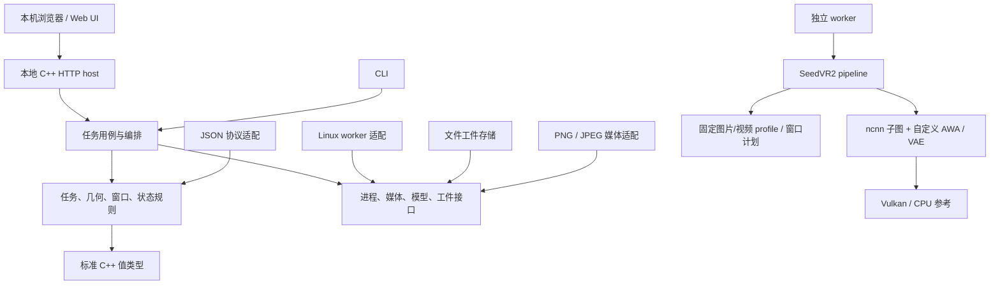
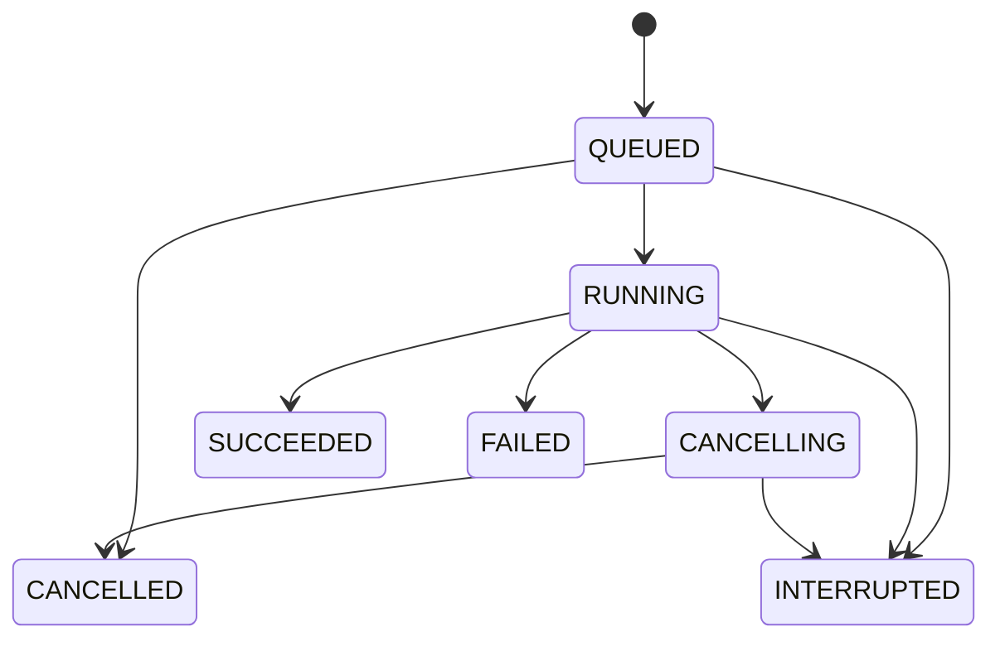

# SeedVR2 框架设计

实现检查点：0.8-media-jobs / 0.5.0-video-preview，2026-09-07。完整图片与整段短片恢复已接通官方 3B 权重、全部 32 个 DiT block、CPU/Vulkan、独立 worker、持久任务及本地 Web 对比。当前事实见 [status.json](status.json) 与 [视频验证](video-validation.md)。本文保留模型执行和扩展边界；长视频、时间缓存、多 GPU、低精度及正式模型认证仍是目标。

现行工程选型为 React / TypeScript / Ant Design + Drogon + SQLite + CLI11，详见 [完整应用框架](full-stack-framework.md)。模型验收独立规范见 [model-validation.md](model-validation.md)。下文重点保留模型执行与资源边界。

## 1. 架构决定

采用浏览器本地 Web 界面、C++ HTTP host 和独立推理进程。Web 与 CLI 共享任务用例，纯 C++ 规则不依赖界面、JSON、媒体库或 GPU 类型。ncnn 在后端内部负责神经网络计算，本框架负责任务、执行计划、资源生命周期和运行工件。

| 方案 | 优点 | 成本 | 决定 |
| --- | --- | --- | --- |
| 一个程序直接串起界面、媒体和网络 | 原型接入快 | 设备失败影响整个进程，测试依赖重，参数易分叉 | 仅适合一次性验证脚本 |
| 模块化应用 + 一个独立 worker | 保持离线分发，隔离 GPU 失败，核心独立测试 | 需要明确进程协议和任务状态 | 本项目采用 |
| 多服务 + 动态插件平台 | 适合远程、多租户和第三方扩展 | 部署、协议、ABI、排错成本较高 | 目前没有对应需求 |

“优雅”由可检查的边界体现：模块职责清楚、单向依赖、值类型传递、失败显式返回、状态变化有唯一入口。“先进”体现在执行前规划、可核对的能力、可取消的资源调度与可复现的工件，不以引入框架数量衡量。

## 2. 依赖方向

当前 CMake target 包括 `seedvr2_validation`、`seedvr2_storage`、`seedvr2_application`、`seedvr2_jobs`、`seedvr2_engine`、CLI `seedvr2`、可关闭构建的 `seedvr2-web` 和真实执行的 `seedvr2-worker`。公共值类型不暴露 JSON、HTTP、SQLite 或 ncnn 类型。Web 任务由监督服务调用 worker，CLI `run` 直接调用同一个 `run_image` 核心；两者不强行共用任务队列。规划与审计继续通过共享 application 接口。FFmpeg 和 Windows 进程适配尚未加入。

## 3. 目录与责任

| 目录 | 责任 | 当前 |
| --- | --- | --- |
| `include/seedvr2` | 小型公共值类型、错误、规划与状态接口 | 已实现基础 |
| `src/planning` | 确定性几何、补帧、窗口元数据 | 已实现基础 |
| `src/runtime` | 单次 run 的状态转移规则 | 已实现 reducer |
| `src/protocol` | JSON 输入检查、结果和错误序列化 | 已实现规划协议 |
| `apps/cli` | 命令行参数、文件读取、调用用例 | 完整单图、规划、审计、自测和子模型诊断 |
| `tests` | 独立官方参考、规则、边界、协议测试 | 已实现基础 |
| `schemas` | 可机器读取的外部格式 | 规划、验收包、图像模型包、任务请求及 OpenAPI |
| `examples` | 不需要权重的复现输入 | 720p 几何规划 |
| `tools` | 开发阶段参考生成与验收 | 不作为用户运行时依赖 |
| `apps/studio`、`apps/server` | React 组件工作区、Drogon host、规划与记录 API | 已接通；旧 apps/web 为历史原型 |
| `apps/worker` | 独立推理进程入口 | 单图执行、进度/result/error NDJSON |
| `src/application` | Web / CLI 共享用例 | 计划、审计、历史、自测；图像核心单独共享 |
| `src/jobs` | 工作区任务与进程监督 | 有界 FIFO、SQLite 事件、取消、重启中断、资源 ID |
| `src/validation`、`src/storage` | 策略、工件哈希、tensor 诊断、SQLite | 已实现审计基础；无模型证书 |
| `src/engine/ncnn` | 模型、权重驻留、DiT/VAE/自定义层 | 36 图完整图片/短片，逐块装载和激活释放 |
| `src/engine/ncnn/image_io.cpp` | 图片预处理、编码、临时文件提交 | PNG/JPEG → RGB8 PNG；video_io.cpp 通过 FFmpeg 共享库提供视频解码与 MP4 编码 |

源文件按一起变化的职责组织。不开设所有模块都能依赖的“万能工具层”。核心类型里没有 DOM、HTTP、`ncnn::Mat`、`VkBuffer` 或 `nlohmann::json` 类型。

## 4. 从用户意图到可执行任务

规划是可重复的计算，准入是基于实物与设备状态的检查，两者分开。模型 manifest 必须区分“理论可表达形状”“经过导出的 profile”“有数值证据的 profile”“在某类设备验证的 profile”。默认 Vulkan 开关不能替代逐算子后端记录。

保留的 `PlanningRequest` 只包含声明的媒体尺寸、帧数、比例和已固定的 3B 语义，不读取媒体或模型。CLI `plan` 输出几何预估、`runnable=false` 及准入缺项。它与当前实际 `ImageJob` 是两个独立协议；单图任务使用已导入媒体 ID、输出尺寸、后端、设备与 seed，经真实解码和包校验后执行，不把几何预估当成可执行证明。

几何规划采用 `preserve-content-v1`：比例使用整数分子/分母，像素尺寸取最近整数，恰好半像素时向上取整，规划向右/下补到 16 倍数和尾帧补到 4n+1；这些仍只是规划计算。实际单图 profile 明确采用 RGB8、bicubic antialias、按输出长边缩放、居中裁到 16 的倍数，范围 64–512，短边至少 64。不同几何语义不复用同一个 profile 身份。

主机规划限制为单轴 65536 像素、4097 输入帧、1 亿 video tokens、100 万窗口，比例分子分母均为 1–64。这些数值只限制 CPU 元数据计算和整数范围，不表示模型、RoPE 或 GPU 支持这些尺寸。实际准入必须另查完整能力和预算。

## 5. AWA 模块的接口和生命周期

公共入口是 `plan_windows(TokenGrid, shifted)`，输出不可变地消费：每窗半开 T/H/W 边界、video token 数和 packed offset。窗口枚举 w→h→t，窗口内部 token 布局 t→h→w。元数据使用整数，不能进入 FP16 数据通道。

当前窗口实现复现官方代理面积 45×80、窗口参数 (4,3,3)、时间上限 30、ties-to-even、shifted 截断与边界裁剪。8 个形状 × 2 种模式的参考由固定官方 Python 文件直接生成。包括 `12.5 → 12` 的取整边界，不从 C++ 结果反向生成参考。

AWA backend 已实现窗口计划、QKV/norm/RoPE、attention、video scatter/text mean 的 CPU/Vulkan 路径和 pnnx 自定义模块导出；完整单图逐层记录实际后端。具体数学与 shader 证据见 [原生后端](native-backend.md)。融合与分组优化需在数值和性能证据下推进。

WindowPlan 缓存身份应包含语义版本、token T/H/W、shifted、窗口参数与文本长度。QKV/文本状态随 block 变化，不能被当作只由形状决定的缓存。纯几何接口自身不执行注意力，几何测试与 AWA 数值测试分别保留。

## 6. 内存、调度和 GPU 生命周期

推理按 SeedVR2 阶段编排：预处理 → VAE encode → 条件/噪声构建 → 32 个 DiT block → 采样与 latent 处理 → VAE decode → 媒体保存。这里是任务阶段，不另造一套通用神经网络图编译器。

资源分为四个生命周期：

| 生命周期 | 典型资源 | 释放点 |
| --- | --- | --- |
| 设备会话 | ncnn device、pipeline cache、allocator | worker 退出/设备重建 |
| 模型阶段 | VAE 或当前 DiT block 权重 | 依赖该阶段的 GPU 工作完成后 |
| 推理单位 | latent、窗口计划、各 VAE 层时间 cache | 图片/冻结 clip 完成或取消 |
| 一次提交 | staging、attention/FFN scratch、临时 command 依赖 | fence/submit 完成后 |

资源由 RAII 对象持有，GPU 完成信号之前不回收或复用 buffer。跨进程只传媒体路径、工件 ID、小型配置和进度，不传 Vulkan 句柄或整块 tensor JSON。模型分片读取、媒体队列和报告预览均有容量上限。

当前每个工作区最多 8 个未完成任务、1 个执行进程。encoder、DiT、decoder 之间释放权重，逐 block 驻留；图内部按最后使用点释放激活，一个任务共享 PipelineCache。精确 FFN/query chunk、大尺寸分块、异步媒体流水与多 GPU 调度尚待实现和验证。

内存报告分别保存单 buffer 理论字节数、ncnn allocator peak、staging peak、设备 heap 预算和供应商采样值。当前 CLI 仅算 `Nv × 2560 × 2` 的一份 FP16 hidden 大小，总峰值为 null。

## 7. worker、取消与状态

Web 的任务服务通过 Linux `posix_spawn` 以固定参数启动相邻 worker，不经过 shell。输入是私有请求文件，stdout 是有版本的 progress/result/error NDJSON，stderr 是任务日志；消息长度和总量有界。父进程死亡时终止 worker。CLI `run` 直接进入共享核心，当前不提供 Web 的持久任务取消记录。Windows 适配、交互命令确认和显式握手超时属于后续设计。

浏览器用 HTTP 发起操作并轮询持久快照；事件接口支持按 sequence 游标续读，当前没有 SSE。断开或关闭网页不取消任务，重开 URL 会取回实际状态。SQLite 事务保存任务与事件，工作区锁保证单个监督者。具体边界见 [本地 Web](local-web.md)。

取消 API 对终态和重复请求幂等；当前没有通用 command_id/revision 协议。事件 sequence 与任务状态独立，服务重启将未完成任务记为 INTERRUPTED。下面是当前图像任务状态；纯 runtime reducer 的更细规划状态不冒充已经连接的任务行为。

取消执行中的任务先进入 CANCELLING，向 worker 发送 SIGTERM，10 秒后仍未退出则 SIGKILL；回收进程后记为 CANCELLED。模型核心有阶段/图提交边界的取消检查。仅成功提交的输出能被下载；被中断的计算不会被伪装成完成。

终态任务不会原地返回 QUEUED。界面重试复用原输入和参数，创建新任务 ID；当前未建立 retry_of 关联字段。重启后不进行任意层续算，保留旧记录供核对。

## 8. 输出提交与可复现工件

每个任务有独立输出目录。worker 写临时 PNG/MP4 和报告并重命名后返回 result 事件。监督者要求成功退出、结果结构有效、实际媒体哈希复核通过，才把任务改为 SUCCEEDED。没有 unit-ready/committed 的视频单位协议。

当前提交顺序为同一输出目录写临时文件 → 编码关闭 → 计算哈希 → 重命名 → worker 返回结果并退出 → 监督者复核 → SQLite 任务/事件事务。文件的原子重命名不提供断电持久性承诺；未完成任务在重启时保持 INTERRUPTED，即使目录里存在结果也不会自动认定成功。恢复索引和逐 clip 提交是后续工作。

图片或冻结短 clip 是最小恢复单位。clip 划分、VAE 时间 cache 的重建起点、overlap 与 seed 身份必须匹配旧任务。状态机本身不提供持久化或任意层续算保证。

当前运行报告记录输入内容、包清单、二进制、ncnn 提交、实际配置、设备、随机算法和 seed；诊断模式另存实际噪声张量及 hash。任务 ID 是随机资源身份，不冒充内容哈希。跨运行数值复核还要求实际噪声一致；没有实现跨任务结果缓存。

## 9. 界面和报告的扩展方式

正式界面改为本地 Web。完整工作区已使用 React + TypeScript + Ant Design + Vite 产出静态资源，由 Drogon C++ host 分发；Node.js 仅用于开发构建。当前 `apps/studio` 包含六个组件工作区，原 `apps/web` 作为历史接线原型保留。六个工作区共用任务摘要、错误条、对比画布与状态组件，颜色、字级、间距、焦点和空状态集中定义。

浏览器编辑态、服务快照、运行事件三者分开；Web 不重写几何或推理默认值。当前规划请求改变后立即清除旧结果，并拒绝迟到响应覆盖新设置。正式执行按钮只由服务端能力与任务准入控制。

界面设计目标是常用流程不被工具参数打断，操作成功、失败和未测试有稳定的视觉表达。新增控件要绑定真实 capability。界面中的对比缩放、逐帧和 ROI 只操作展示状态，不更改推理配置。

报告与 Discussion 草稿消费选定的实际图像任务、自测/审计记录及能力响应，包含记录 ID、输入/输出/模型/二进制哈希和运行耗时。数值一致性、视觉质量、产品可用性分别判定；当前没有正式 ReviewRecord/ClaimRecord 注册系统，也不自动发布到 GitHub。

## 10. 构建、依赖与验证顺序

C++20 用于标准值类型、span/RAII 与后续 stop_token 协作取消。当前基础不要求 C++ modules、协程运行时或复杂 DI 容器。CMake 3.25+ 使用项目级 target 和 Presets。nlohmann/json 3.12.0 固定头文件与许可证随源码保存，配置构建不下载依赖。

Web host 固定 Drogon 1.9.13，界面资源内嵌到可执行文件；用户运行时无需 Node.js、Python 或 CDN。当前图片 IO 使用固定 ncnn 来源的 stb，模型执行依赖 ncnn/Vulkan；FFmpeg 尚未引入。ncnn 与 pnnx 使用独立下载、已记录 hash 的官方提交 `6a1bf000f363714839a36793addc8c879d3d899e`，不链接旁边的工作树；来源与上游后续变更见 [provenance.md](provenance.md)。Windows 需要实际编译和试运行后才能标记支持。

实现进度：

1. 已有基础：公共类型、规划、窗口、状态、JSON/CLI，以及正式 Web 技术栈、持久计划、模型证据审计。
2. 已完成 AWA CPU/Vulkan、单帧 VAE、全部 DiT 图导出与单图参考轨迹。
3. 已完成单图包、实际媒体、worker、输出提交、Web 对比、队列恢复及本地草稿。
4. 已完成短片时间 VAE/3D AWA、MP4/同步对比；17 帧数值失败保留。待完成参考 A、长视频/时间缓存、低精度、大尺寸及峰值内存/暖跑性能。
5. 待完成正式数据集、策略冻结、完整模型证据包、跨平台与便携发行验收。

测试从无 GPU 的规则与格式、官方几何参考，逐步到算子/模块/整网/媒体/应用。每类状态独立保存，基础框架通过不能代替模型 gate。

官方工程参考：[CMake Presets](https://cmake.org/cmake/help/latest/manual/cmake-presets.7.html)、[nlohmann CMake 集成](https://json.nlohmann.me/integration/cmake/)、[cpp-httplib](https://github.com/yhirose/cpp-httplib/tree/v0.54.1)、[Vite 静态构建](https://vite.dev/guide/static-deploy.html)。窗口参考与许可证见 [provenance.md](provenance.md)。
