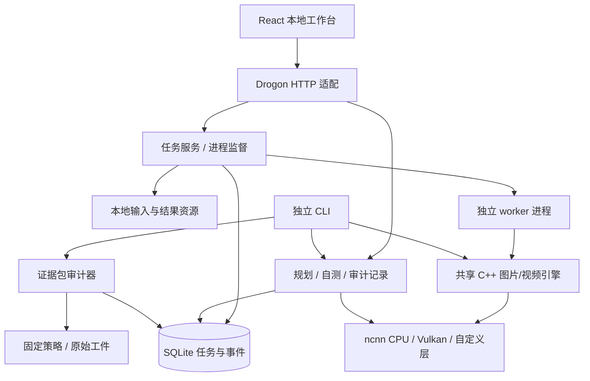

# 完整应用框架

本页保留 0.8-media-jobs / 0.5.0-video-preview 的应用框架设计。0.6.0 已增加可安装的共享 SDK、公共预检与模型复制；当前公共边界和源码导航以 [ARCHITECTURE.md](ARCHITECTURE.md) 为准，当前执行证据见 [DELIVERY-RESULTS.md](DELIVERY-RESULTS.md)。

## 技术栈与职责

| 层 | 实现 | 职责 |
| --- | --- | --- |
| 界面 | React 19.2.8、TypeScript 7.0.2、Ant Design 6.6.2、Vite 8.2.2 | 图片/视频导入、设置、任务状态、结果检查与下载；静态资源内嵌 |
| 路由与远端状态 | React Router 8.3.1、TanStack Query 5.102.8 | 可重开的 URL、请求生命周期、错误及刷新；业务状态由服务器保存 |
| 本地 HTTP | Drogon 1.9.13 | 同源路由、会话和资源 ID 边界，异步 HTTP 适配 |
| 独立 CLI | CLI11 2.7.2 | 直接调用共享 C++20 运行时及验收器，不包装 HTTP |
| 任务服务 | `seedvr2_jobs`、Linux process adapter | 有界队列、独立 worker、取消、重启恢复和顺序事件 |
| 持久化 | SQLite schema 3、WAL、FULL synchronous | 任务/事件事务、媒体索引、历史规划、审计和算子自测 |
| 模型核心 | `seedvr2_engine` | 完整图片/时序 VAE/32-block DiT/Euler、逐块装载、图生命周期 |
| 计算适配 | 固定官方 ncnn、自定义 AWA/Constant/四类时序 VAE 层、CPU/Vulkan | 图层按指定后端执行，缺少支持时拒绝回退 |
| 验收 | 独立 model evidence auditor | 相对工件路径、实际 SHA-256、原始张量误差、缺项及失败结论 |

这是模块化的单机应用，按依赖边界拆分，推理使用进程隔离。运行时不需要额外数据库服务器、外部任务队列、Node/Python 服务、账户系统或 CDN。前端按工作区按需加载，应用状态可从 SQLite 恢复。

## 已连接的调用关系

公共 C++ 头文件使用标准类型；HTTP、SQLite、ncnn 和 JSON 库细节留在实现模块。Web 的任务进程隔离真实推理故障，内置小型算子自测仍在 HTTP 服务的应用线程中执行；不把自测说成独立 worker。大型张量/模型保存在文件中，SQLite 保存有界配置、进度和摘要。

## 用户流程

1. 图片或视频导入后得到随机资源 ID，浏览器不发送任意主机文件路径。
2. 提交固定版本的 ImageJob/VideoJob 请求；服务器校验媒体类型和尺寸、参数和最多 8 个未完成任务的上限。
3. 监督线程串行启动真实 worker。stdout 是有界 NDJSON 协议，stderr 保存本次诊断；不通过 shell 执行。
4. 进度事件先进入 SQLite 事务，再由 API 提供；前端轮询快照，事件接口支持 sequence 游标续读。
5. worker 成功、最终 PNG/MP4 与运行报告已提交、实际媒体哈希复核通过后，任务才能成为 SUCCEEDED。
6. 用户在历史记录中重开、重试、对比、保存 PNG/MP4 或报告，并把实际任务加入 Discussion 草稿。

关闭浏览器不停止服务。取消运行先发送 SIGTERM，10 秒后仍不退出则 SIGKILL。服务重启把所有未完成状态变成 INTERRUPTED，保留输入和参数；重试创建新任务，不假装从断点恢复神经网络计算。Linux 使用父进程死亡信号和单工作区监督锁，避免孤儿 worker 和重复监督。

## 工作区

| 页面 | 可用功能 |
| --- | --- |
| 新建处理 | 图片/视频导入、片段/尺寸/设备设置、高级 seed、实际推理、进度、取消/重试、对比、PNG/MP4 保存 |
| 处理任务 | 持久真实任务、状态、重开、取消、完成结果下载；另有旧规划列表 |
| 结果对比 | 真实输出、对齐输入、滑块、输入/结果切换、100% 像素查看、视频同步播放与同帧暂停/逐帧、报告下载 |
| 测试记录 | 设备检测、AWA 自测、PASS/FAIL 历史、CLI 导入的模型审计、原始报告 |
| 模型验收 | 12 项模型要求、正式缺项、策略身份、未冻结/未签发状态 |
| 报告与分享 | 当前能力、选定自测和真实媒体任务、原始 JSON、Discussion Markdown 草稿 |
| 视频与大尺寸规划 | 纯几何预估、配置导出、保存计划；大尺寸/长视频规划不执行推理 |

当前图片/短片完整链路和开发数值证据不自动提升正式模型认证状态。策略未冻结，正式验收包、质量和长视频验证仍缺失，17 帧短片已有严格数值失败。

## 安装与数据

默认工作区为 `$XDG_DATA_HOME/seedvr2/workspace.sqlite3`，或 `~/.local/share/seedvr2/workspace.sqlite3`。模型查找规则和导出流程见 [image-runtime.md](image-runtime.md)。`--database` 可选择工作区；输入与结果位于数据库旁的 `<stem>-files` 私有目录。schema 1/2 会迁移至 3，旧记录保留，未来 schema 的降级打开会被拒绝。

`SEEDVR2_BUILD_WEB=OFF` 的 CLI 构建不寻找 Drogon 或前端资源。运行 `seedvr2 run` 或 `run-video` 无需服务，结果写入显式输出目录。`history` 读取规划/审计/自测记录；图像任务由 Web 任务服务管理，CLI 完整处理不会伪造一份 Web 任务。

C++/前端/模型来源分别由三个 dependency lock、npm lock 和模型 source lock 固定。ncnn/pnnx 从独立下载的官方归档构建，不链接相邻工作树。系统运行库和 Vulkan 驱动仍是平台依赖；当前验证是本机安装，不是跨发行版便携认证。旧 cpp-httplib 原型在 `apps/web`，不参与当前构建。

## 仍需实现

后段 DiT 视频误差定位、时间缓存/分块、更高分辨率、低精度和融合算子、可测的峰值内存、跨平台进程适配、图像元数据、正式画质集和完整验收包。当前事件传输是持久游标轮询，未实现 SSE。当前没有托盘、自动浏览器启动器和跨平台安装器。

视频 IO 由原生 FFmpeg 共享库处理；整段短片作为一个任务提交结果，未实现按视频 chunk 提交和断点恢复。SQLite 仍为 schema 3：任务 payload 按图片/视频协议区分，既有表名和旧历史保留。详细新增层、生命周期及媒体边界见 [视频运行时](video-runtime.md)。
