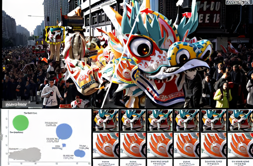

# 0.4.0 完整单图验证记录

2026-09-07，本机 Linux x86_64 / NVIDIA GeForce RTX 4060 Laptop GPU。**已能完成真实 ncnn CPU/Vulkan 单图推理、导出 PNG，并从本地 Web 导入、排队、取消、重试和对比。模型正式认证仍未签发。** 机器状态见 [status.json](status.json)，来源/构建/报告清单见 [image-manifest.json](image-manifest.json)。

## 运行范围与参考

固定包 `seedvr2-3b-image-fp32-b-v1`，官方 3B/VAE 权重，FP32，T=1，单步 CFG=1，timestep=1000，latent scale=0.9152，color_fix=none。完整执行 36 图，包括 encoder、patch-in、32 个相连 DiT block、patch-out、decoder。ncnn/pnnx 固定官方提交 `6a1bf000f363714839a36793addc8c879d3d899e`，未使用相邻工作树；它是本轮独立下载并验证的快照，上游已前进，详见 [来源记录](provenance.md)。

独立参考执行固定 SeedVR 官方原始 NaDiT/VAE/sampler 类，使用显式 FP32-B 适配替换外部加速依赖。参考消费候选保留的实际 posterior/DiT noise；不把相同 seed 当作跨随机库序列相同的证明。原始方法和参考包装与候选导出表达分开保存。此范围不包含官方 BF16/FlashAttention A 路径、视频、质量保留集或发布认证。

## 整网数值对比

开发诊断阈值为 `abs(candidate-reference) <= 0.001 + 0.001*abs(reference)`，最终 RGB8 像素绝对误差 ≤1。每条轨迹比较 **73 项**：预处理、posterior/scaling、投影、全部 block 的 video/text、velocity/latent/decoder 等中间结果。它们是张量检查项，不是 73 个独立输入样本。输入为同一张官方 teaser 合成图，尺寸 1058×720；这限制了结论的输入覆盖范围。

| 执行 | 输出 | 逐张量检查 | RGB8 最大误差 | 报告 |
| --- | --- | --- | --- | --- |
| Vulkan / 原始完整参考 | 128×80 | 73/73 PASS | 1；34/30720 通道值不同 | [reference-128](image-reference-128.json) |
| Vulkan / 原始完整参考 | 256×160 | 73/73 PASS | 1；33/122880 通道值不同 | [reference-256](image-reference-256.json) |
| CPU / 保留参考复核 | 128×80 | 73/73 PASS | 1 | [CPU replay](image-parity-128-cpu.json) |
| 最终 Vulkan / 保留参考复核 | 256×160 | 73/73 PASS | 1 | [Vulkan replay](image-parity-final-256-vulkan.json) |

replay 检查参考报告与原始 run 的绑定、输入/模型/profile/采样身份、实际噪声字节及 hash、张量尺寸、输出 PNG hash，以及 Vulkan 日志。不是直接信任历史 PASS。原始参考生成和最终优化后运行分别保留二进制/脚本 hash，不将旧二进制报告改写为新报告。

512×336 已有实际完成输出，但没有运行该尺寸的 73 项完整数值参考。对 512 的结论是功能完成，不能继承 128/256 的逐张量结论。正式 12 项模型策略仍为缺证据/未冻结；详见 [model-validation.md](model-validation.md)。

## 实际运行与耗时

| 本机单次执行 | 总耗时 | 性质 |
| --- | --- | --- |
| CPU，128×80 | 37.58 s | 实际完整运行，见 [run](image-run-128-cpu.json) |
| Vulkan，256×160，优化前 | 65.24 s | 保留参考所对应运行，见 [run](image-run-256-vulkan.json) |
| Vulkan，256×160，共享 PipelineCache 后 | 42.84 s | 最终 CLI，见 [run](image-run-final-256-vulkan.json) |
| Vulkan，512×336 | 77.45 s | 优化前功能执行，见 [run](image-run-512-vulkan.json) |
| 浏览器实际导入 128×87 → 512×336 | 63.45 s | 最终 worker，见 [任务](examples/image-demo-job.json) / [run](examples/image-demo-run.json) |

这些是单次观测，包含文件哈希、装载、图执行和 PNG 编码；没有冷/暖跑重复统计，不能当成正式基准或普遍 GPU 加速倍数。最终 256 运行图计算约 3.6 s，主要耗时仍来自约 20.44 GB 图文件的完整性读取、权重装载和准备。峰值内存/显存未做完整测量，不声称达成 8GB/720p 目标。

上述 Vulkan 成功运行均启用 Khronos validation 检查，保留的诊断日志没有 VUID / Validation Error。最后一条用户工作区演示没有额外开启 validation layer；其逐图报告仍记录 36 图 `cpu_layers=0`。图像 IO、布局、噪声、posterior/Euler 主机算术是显式 CPU 工作，不计入“网络层无回退”的断言。

## 应用与工程检查

| 验证 | 结果 | 说明 |
| --- | --- | --- |
| [真实任务服务](image-jobs-validation.json) | 39/39 | 实际 worker、上传、8 项队列上限、取消、失败 GPU 不回退、下载/哈希、事件游标、强制中断与重启恢复 |
| [模型包/CLI 拒绝边界](image-boundaries-validation.json) | 12/12 | 错误 profile/ncnn/sampling、缺图/重复图、param/weight hash、目录逃逸、符号链接、重复 JSON、非法尺寸 |
| [安装版 HTTP](image-install-http-validation.json) | 58/58 | CLI/HTTP 一致性、实际 AWA、SQLite 1→3、HTTP/会话/文件边界；与整网数值证据分开 |
| [独立 CLI 构建](image-cli-only-validation.json) | 10/10 | 关闭 Web 后独立构建及行为 |
| [引擎边界](image-engine-validation.json) | 23/23 | 参数、图和设备拒绝行为 |
| [验收器负向测试](image-audit-validation.json) | 31/31 | 合成证据审计逻辑；不是模型测试 |
| [开发版 CTest](image-ctest.xml) / [CLI-only CTest](image-cli-only-ctest.xml) | 各 4/4 | 规则、协议与官方窗口几何 |
| [安装与启动](image-install-validation.json) | 10/10 | 二进制一致、动态依赖、许可、契约、任意工作目录模型发现 |
| [实际契约](image-contract-validation.json) | PASS | 实际 ImageJob 请求、模型包、任务响应通过 schema 检查 |
| [现用工作区迁移](image-workspace-migration.json) | PASS | 2→3，原有 4 条规划/审计/自测记录逐字保留，升级前有备份 |
| [浏览器交互](image-browser-validation.json) | 见逐项记录 | 实际图片、结果/100%/滑块、下载、重开 URL、窄屏、模型缺项与本地草稿 |

前一版的 native-*、framework-*、web-*、foundation-* 清单保留原始版本/哈希，不重新冒充本版验证。没有在本轮新增 sanitizer 或跨平台测试结论。

## 可直接检查的演示

任务 `d3dec86e500d2010e302a6322c605abb` 由浏览器实际导入并提交，GPU=自动选择后落到 RTX 4060，seed=666，输出已保存。图像来自官方 teaser 的 128 像素缩略版本，包含拼接画面和图表，只演示功能；不能用它证明普遍画质。来源与变换见 [输入 provenance](examples/image-demo-input-provenance.json)。

| 输入 | 实际 ncnn 输出 |
| --- | --- |
|  |  |

工作台提供按输出尺寸对齐的输入、滑动分界、100% 像素查看及原始 PNG 下载。浏览器保存的输出 SHA-256 为 `a9660bfcf638264117a3c8502772786fdfc699940d8b455da46819f2cff1e6bb`，与实际任务报告相同。[Discussion 本地草稿](image-discussion-draft.md) 包含该任务的版本、二进制、模型及输出 hash，输入 hash 和完整设备记录保存在关联任务 JSON；没有向外部网站发布。

## 剩余工作

1. 扩展输入/形状覆盖，建立独立画质保留集，运行官方 A 路径并校准 FP16/BF16 与整网阈值。
2. 时间 VAE、因果缓存、短 clip/长视频分块和边界一致性；当前只支持图片。
3. 提升分辨率上限，优化权重与 shader 准备，测量冷/暖跑和峰值 RAM/VRAM。
4. 正式模型证据注册、策略冻结、独立复核与可失效的范围证书；当前不会自动签发。
5. EXIF/ICC/alpha、Windows/其他 GPU、便携依赖、项目许可和模型分发整理。

运行和重新导出方法见 [README](../README.md)、[完整单图运行时](image-runtime.md)。
