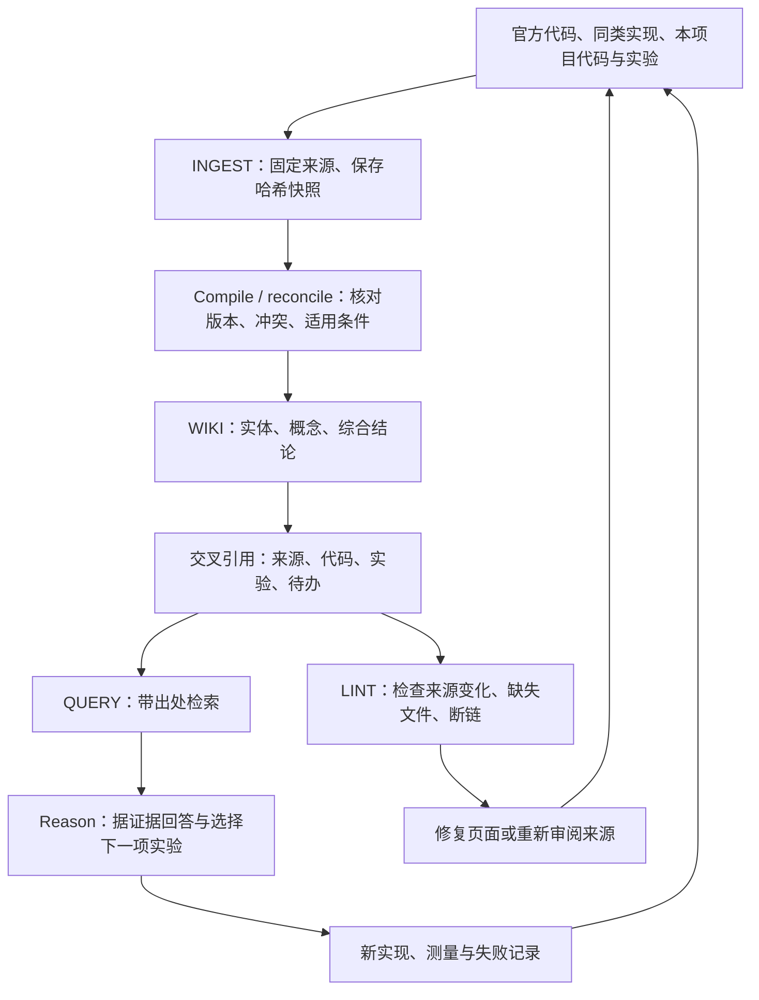

# 项目知识与改进闭环

这里保存 SeedVR2 原生移植的来源、设计取舍和验证入口。架构正文仍在 [ARCHITECTURE](../ARCHITECTURE.md)，当前交付边界仍在 [CURRENT-GAPS](../CURRENT-GAPS.md)，历史实验仍保留在原目录；知识页负责连接这些证据。



## 入口

| 类型 | 页面 | 用途 |
| --- | --- | --- |
| entities | [本项目](entities/seedvr2-native.md) | 模型、应用入口、已有数值范围 |
| entities | [同类移植](entities/peer-ports.md) | 固定到具体仓库 revision 的设计证据 |
| concepts | [数值与质量](concepts/precision-and-evidence.md) | 明确参考、精度、指标和认证的区别 |
| concepts | [视频与内存](concepts/video-and-memory.md) | 时序、分块、权重放置及 cache 的不同含义 |
| synthesis | [设计对照](synthesis/design-comparison.md) | 哪些设计值得借鉴，哪些结论已经被更新 |
| synthesis | [改进顺序](synthesis/delivery-plan.md) | 每项工作的输入、验收和停止条件 |
| synthesis | [本轮交付记录](synthesis/delivery-2026-09-13.md) | 把实际执行结果回写为下一轮来源 |

## 操作

在仓库根目录运行，工具只需要 Python 标准库：

```sh
# 抓取登记过的固定来源，保存原文和带时间的回执
python3 tools/knowledge.py ingest --source aichi-port

# 默认离线检查：来源文件哈希、页面登记、双向关系及本地链接
python3 tools/knowledge.py lint

# 普通关键词检索，结果携带来源 ID 和关联页面
python3 tools/knowledge.py query "VAE cache"
python3 tools/knowledge.py query "模型 分发"
```

来源登记在 [sources.json](sources.json)。远程文件使用固定 commit 的原始文件地址；本项目文件记录相对路径和 SHA-256。`ingest` 将原文放入忽略目录 `.cache/knowledge/<source-id>/<sha256>.source`，另存回执；相同内容复用原文，旧回执保留。外部文本只作为资料，工具不会执行其中的命令。

`Compile / reconcile` 是审阅步骤：读原文，核对实现、输入、设备、参考和日期；冲突时保留旧结论的来源以及新证据。然后修改知识页、关联关系和来源哈希。工具不会因下载成功而自动更新审阅状态，也不会把网页中的性能主张变成本项目实测。

`lint` 不访问网络，因此不会发现远程分支的新提交；升级同类项目 revision 时先显式修改候选来源并抓取，再审阅差异。它检查链接文件存在，不解释 Markdown 片段锚点，也不证明论断真实。`query` 是文本检索，后续推理需要阅读返回的来源和实验。这里没有向量数据库、常驻服务或后台定时任务。

每轮在 [log.md](log.md) 追加“来源 → 冲突处理 → 行动 → 验证 → 剩余问题”，并运行 lint。涉及数学、图结构、精度或资源策略变化时，按影响范围重做组件对照；纯文档或安装工具更新沿用未受影响的大模型实验。
